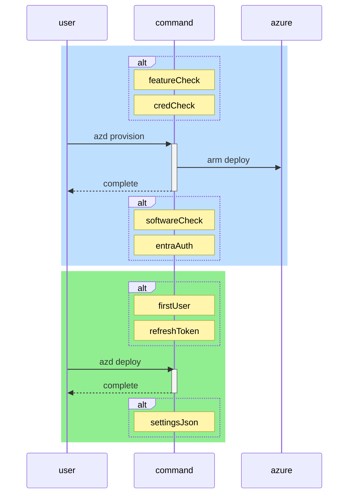

# OSDU Developer

[](https://opensource.org/licenses/MIT)

[Open Subsurface Data Universe](https://osduforum.org) (OSDU) is a standard data platform that brings together a diverse array of subsurface and well data. It enables the energy industry to access and analyze data across various sources efficiently. This project aims to provide a streamlined approach to showcase a mechanism to develop and work directly with [OSDU](https://community.opengroup.org/osdu/platform) while using the [Microsoft Azure Cloud](https://azure.microsoft.com/).

## Guiding Principles

The guiding principle of this development approach is to offer a way to facilitate direct engagement with the OSDU codebase on the Azure Cloud in a minimal fashion. This is not recomended for any production use and is purely seen as a method for development and does not come with any type of official support. The approach aligns with three key pillars from the [Azure Well-Architected Framework](https://learn.microsoft.com/en-us/azure/well-architected/what-is-well-architected-framework):

1. **Cost Optimization** -- We aim to create a cost-effective approach, balancing cost along with security considerations.
2. **Security** -- Our goal is to enhance security levels within the constraints of working to allow for development in a secure manner, working to ensure a zero trust approach to development.
3. **Operational Excellence** -- A strong DevOps, Standards, and Automation approach is always thought of first.

To support ease of use, this idea integrates closely with [Github Codespaces](https://github.com/features/codespaces) and the [Azure Developer CLI](https://learn.microsoft.com/en-us/azure/developer/azure-developer-cli/), working to facilitate seamless development and innovation on ideas.

**Bicep for Desired State Configuration**

Bicep is a domain-specific language (DSL) for deploying Azure resources declaratively. It is built on top of Azure Resource Manager (ARM) templates and simplifies the syntax and experience of authoring ARM templates. With Bicep, you define the desired state of your Azure infrastructure in code. This includes specifying the resources you want to deploy, their configurations, and the relationships between resources.

When you deploy a Bicep file, Azure Resource Manager (ARM) processes the file and ensures that the Azure environment matches the defined desired state. If the actual state drifts from the desired state defined in the Bicep file, redeploying the Bicep template can correct this drift, realigning the actual state with the desired state.

**GitOps for Desired State Management**

GitOps extends the desired state management concept to application deployment. It uses Git as a single source of truth for declarative components and applications. With GitOps, you store the entire state of your software components and applications in Git repositories, and any changes to the state are made through Git commits.

Automated processes or operators continuously monitor the Git repository for changes. When a change is detected, these operators ensure that the actual state of the components or application (running in environments such as Kubernetes) is updated to match the desired state defined in the Git repository.

**Combination of Bicep and Gitops**

The combination of Bicep and GitOps is a powerful strategy that allows for a single place where both the infrastructure and software are fully defined, enabling the system itself to work towards achieving the state that has been described. This integrated approach ensures alignment between infrastructure provisioning and application deployment, streamlining and automating the entire provisioning and application deployment process.

# Azure Developer CLI - Deployment

The recommended approach for working with this solution is by using the [Azure Developer CLI](https://learn.microsoft.com/en-us/azure/developer/azure-developer-cli/overview). This method provides greater flexibility for customization and setting options. Here’s a streamlined guide to using the Azure Developer CLI:

The solution enables alternate configurations based off of feature flags. See the document [feature-flags](docs/feature-flags.md) for alternate configurations.

## Enabling Alpha Features for Azure Developer CLI

This solution utilizes Alpha Features in the Azure Developer CLI for advanced functionalities.

**Resource Group Scoped Deployments**

This allows more granular control over deployments at the resource group level.

Enable this feature using the following command:

```bash
azd config set alpha.resourceGroupDeployments on
```

Note: Alpha features are in experimental stages and may undergo changes.

## Authentication

Authenticate your session to interact with Azure resources:

```bash
azd auth login
```

## Setting Up Environment Variables

Define the necessary environment variables for your deployment:

1. Initialize the environment and set the Azure Client ID:

```bash
azd init -e dev
```

2. Set the Azure Subscription ID:

```bash
azd env set AZURE_SUBSCRIPTION_ID $(az account show --query id -o tsv)
```

3. Set Azure Client ID:

Replace <your_ad_application_name> with your actual Azure AD Application Name.

```bash
APP_NAME=<your_ad_application_name>
azd env set AZURE_CLIENT_ID $(az ad app list --display-name $APP_NAME --query "[].appId" -otsv)
```

4. Set Software Repository Location:

Configure the location of where the software declaration is.

```bash
azd env set SOFTWARE_REPOSITORY https://github.com/azure/osdu-developer
azd env set SOFTWARE_BRANCH main
```

## Deploying the Solution

Efficiently manage the resources with these Azure Developer CLI commands. They are designed to streamline the deployment process, allowing for a smooth setup and teardown of an environment.

**Provision**

To initiate the deployment, use the following command:

```bash
azd provision
```

**Configure**

Prior to running this command on the ingress url `https://<your_ingress>/auth/` retrieve an authorization code to use in getting a refresh token to be used when calling APIs.

```bash
azd env set AUTH_CODE <your_auth_code>
azd hooks run predeploy
```

**Execute**

The environment is now ready for use and API calls can be made. [Rest scripts](tools/rest-scripts/README.md) can be used now to run api checks as desired.

**Removal and Cleaning up**

The resource group can be deleted manually and keyvaults and app configuration purged or use the following command:

```bash
azd down --purge --force
```

This command will stop all running services and remove resources that were created during the deployment. The --purge flag ensures that any keyvaults are completely removed, and the --force option bypasses any confirmation prompts, making the process faster.

# ARM Template - Deployment

Deploying the resources is efficient and straightforward using an ARM (Azure Resource Manager) template. While this method utilizes default settings for ease of use, it's worth noting that navigating parameter options can be challenging. For users seeking customization, we recommend using the Azure Developer CLI - Deployment, detailed in the following section.

To facilitate a smooth deployment experience, we provide a "Deploy to Azure" button. Clicking this button will redirect you to the Azure portal, where the ARM template is pre-loaded for your convenience.

**Important Parameter Requirement:**

During the deployment process, there's one essential parameter you need to provide:

`applicationClientId`: Fill this with the Application ClientId that you intend to use. This step is crucial for the proper functioning of the template.
Upon completing the deployment, the infrastructure and software components will be automatically provisioned. This includes loading the software configuration through a [GitOps](https://learn.microsoft.com/en-us/azure/architecture/example-scenario/gitops-aks/gitops-blueprint-aks) approach, enabled by AKS (Azure Kubernetes Service).

To begin, simply click the button below:

[](https://portal.azure.com/#create/Microsoft.Template/uri/https%3A%2F%2Fraw.githubusercontent.com%2FAzure%2Fosdu-developer%2Fmain%2Fazuredeploy.json)

# Sequence Diagram

This diagram documents how the interactions work for the Azure CLI Developer Command Structures

<!--- https://diagrams.helpful.dev/ --->



# Infrastructure

The architecture diagram below provides a visual representation of the infrastructure when deployed. It's designed to help you understand the various components and how they interact within the Azure environment.

![[0]][0]

## Key Components Illustrated in the Diagram:

1. Azure Virtual Network: Illustrates the network and how feature enablement changes the network structure and subnets.
2. Azure Kubernetes Service (AKS): Demonstrates the Kubernetes clusters and an example of how software is set up along with interactions to other Azure services.
3. Storage Resources: Illustrates the use of services such as Azure Storage Accounts and Azure Cosmos Databases and how they connect to the network.
4. Optional Features: If enabled, features like the Bastion Host, Public Blob Access and Pod Subnet are represented, attempting to show their placement and role within the architecture.

## Software Management with a Gitops Approach

In this workspace, we utilize a GitOps approach for efficient and reliable software management. This method leverages this Git repository as the source of truth for defining and updating the software configurations and deployments within the infrastructure.

### GitOps Configuration

Our GitOps configuration resides in this Git repository and uses a customized [repo-per-team](https://fluxcd.io/flux/guides/repository-structure/#repo-per-team) pattern. This repository includes:

- **Configuration Files**: YAML files defining the desired state of our components and applications.

- **Charts**: Helm charts used for defining, installing, and upgrading Kubernetes applications.

### Advantages of GitOps

- **Consistency and Standardization**: Ensures consistent configurations across different environments.
- **Audit Trails**: Every change is recorded in Git, providing a clear audit trail.
- **Rollbacks and Recovery**: Every change is recorded in Git, providing a clear audit trail.
- **Enhanced Security**: Changes are reviewed through pull requests, increasing security and collaboration.

Our GitOps approach simplifies the process of deploying and managing software, making it easier to maintain and update, as well as providing a configurable way of leveraging other software configurations by pointing to alternate repositories hosting other configurations. By leveraging this method, we ensure that our deployments can be extended to things that not only include the default software load.

## Customizations

There are many things that can be done to customize the deployment. One example of this might be virtual network injection.

See [this tutorial](docs/vnet-injection.md) for how a customization like this might be performed.

## Trademarks

This project may contain trademarks or logos for projects, products, or services. Authorized use of Microsoft
trademarks or logos is subject to and must follow
[Microsoft's Trademark & Brand Guidelines](https://www.microsoft.com/en-us/legal/intellectualproperty/trademarks/usage/general).
Use of Microsoft trademarks or logos in modified versions of this project must not cause confusion or imply Microsoft sponsorship.
Any use of third-party trademarks or logos are subject to those third-party's policies.

[0]: docs/images/architecture.png "Architecture Diagram"
