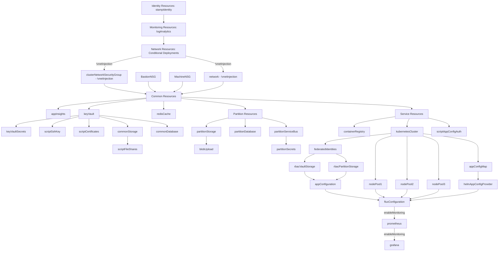

# Infrastructure Code

```mermaid
graph TD
  IdentityResources["Identity Resources: stampIdentity"]
  MonitoringResources["Monitoring Resources: logAnalytics"]
  ConditionalNetwork["Network Resources: Conditional Deployments"]
  ClusterNSG["clusterNetworkSecurityGroup - !vnetInjection"]
  Network["network - !vnetInjection"]
  CommonResources["Common Resources"]
  AppInsights["appInsights"]
  KeyVault["keyVault"]
  KeyVaultSecrets["keyVaultSecrets"]
  ScriptSshKey["scriptSshKey"]
  ScriptCertificates["scriptCertificates"]
  CommonStorage["commonStorage"]
  ScriptFileShares["scriptFileShares"]
  CommonDatabase["commonDatabase"]
  RedisCache["redisCache"]
  PartitionResources["Partition Resources"]
  PartitionStorage["partitionStorage"]
  PartitionDatabase["partitionDatabase"]
  PartitionServiceBus["partitionServiceBus"]
  BlobUpload["blobUpload"]
  PartitionSecrets["partitionSecrets"]
  ServiceResources["Service Resources"]
  ContainerRegistry["containerRegistry"]
  KubernetesCluster["kubernetesCluster"]
  NodePool1["nodePool1"]
  NodePool2["nodePool2"]
  NodePool3["nodePool3"]
  FederatedIdentities["federatedIdentities"]
  RbacVaultStorage["rbacVaultStorage"]
  RbacPartitionStorage["rbacPartitionStorage"]
  AppConfiguration["appConfiguration"]
  AppConfigMap["appConfigMap"]
  HelmAppConfigProvider["helmAppConfigProvider"]
  FluxConfiguration["fluxConfiguration"]
  Prometheus["prometheus"]
  Grafana["grafana"]
  DeploymentScript["scriptAppConfigAuth"]
  IdentityResources --> MonitoringResources
  MonitoringResources --> ConditionalNetwork
  ConditionalNetwork -->|"!vnetInjection"| ClusterNSG
  ConditionalNetwork -->|"!vnetInjection"| Network
  ClusterNSG --> CommonResources
  BastionNSG --> CommonResources
  MachineNSG --> CommonResources
  Network --> CommonResources
  CommonResources --> AppInsights
  CommonResources --> KeyVault
  KeyVault --> KeyVaultSecrets
  KeyVault --> ScriptSshKey
  KeyVault --> ScriptCertificates
  KeyVault --> CommonStorage
  CommonStorage --> ScriptFileShares
  KeyVault --> CommonDatabase
  CommonResources --> RedisCache
  CommonResources --> PartitionResources
  PartitionResources --> PartitionStorage
  PartitionResources --> PartitionDatabase
  PartitionResources --> PartitionServiceBus
  PartitionStorage --> BlobUpload
  PartitionServiceBus --> PartitionSecrets
  CommonResources --> ServiceResources
  ServiceResources --> ContainerRegistry
  ServiceResources --> KubernetesCluster
  KubernetesCluster --> NodePool1
  KubernetesCluster --> NodePool2
  KubernetesCluster --> NodePool3
  KubernetesCluster --> FederatedIdentities
  FederatedIdentities --> RbacVaultStorage
  FederatedIdentities --> RbacPartitionStorage
  RbacVaultStorage --> AppConfiguration
  RbacPartitionStorage --> AppConfiguration
  KubernetesCluster --> AppConfigMap
  AppConfiguration --> FluxConfiguration
  NodePool1 --> FluxConfiguration
  NodePool2 --> FluxConfiguration
  NodePool3 --> FluxConfiguration
  AppConfigMap --> HelmAppConfigProvider
  HelmAppConfigProvider --> FluxConfiguration
  FluxConfiguration -->|"enableMonitoring"| Prometheus
  Prometheus -->|"enableMonitoring"| Grafana
  ServiceResources --> DeploymentScript
```