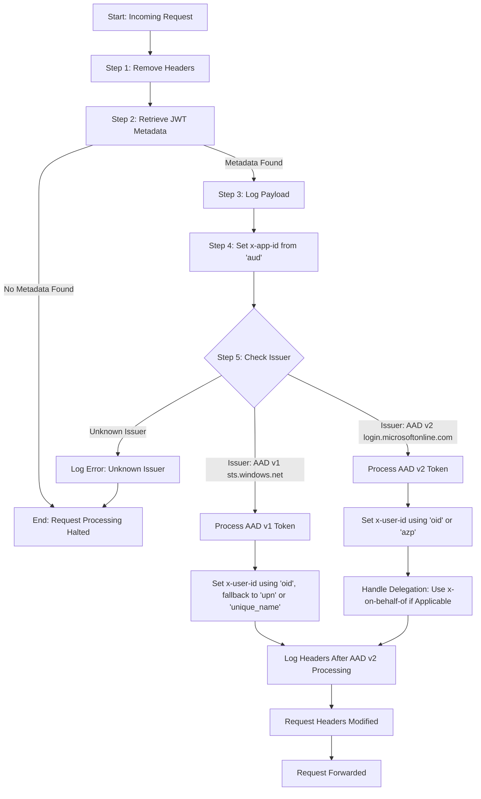

```mermaid
graph TD
    A[Start: Incoming Request] --> B[Step 1: Remove Headers]
    B --> C[Step 2: Retrieve JWT Metadata]
    C -->|Metadata Found| D[Step 3: Log Payload]
    C -->|No Metadata Found| E[End: Request Processing Halted]
    D --> F[Step 4: Set x-app-id from 'aud']
    F --> G{Step 5: Check Issuer}
    G -->|Issuer: AAD v1 sts.windows.net| H[Process AAD v1 Token]
    G -->|Issuer: AAD v2 login.microsoftonline.com| I[Process AAD v2 Token]
    G -->|Unknown Issuer| J[Log Error: Unknown Issuer]
    H --> H1[Set x-user-id using 'oid', fallback to 'upn' or 'unique_name']
    H1 --> K[Log Headers After AAD v1 Processing]
    I --> I1[Set x-user-id using 'oid' or 'azp']
    I1 --> I2[Handle Delegation: Use x-on-behalf-of if Applicable]
    I2 --> K[Log Headers After AAD v2 Processing]
    J --> E
    K --> L[Request Headers Modified]
    L --> M[Request Forwarded]
```