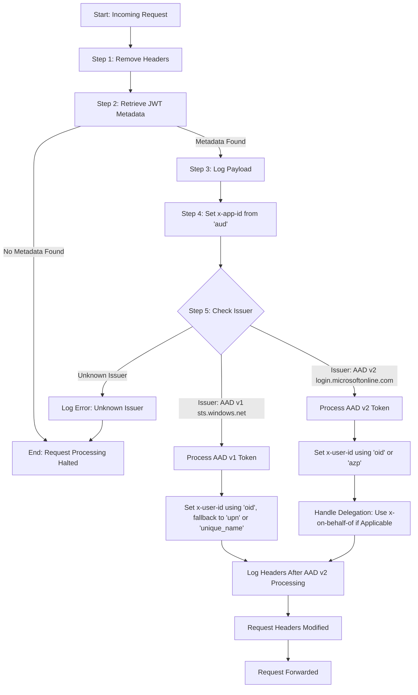

# Microsoft Identity Filter for Istio Envoy

This contains the configuration and logic for an EnvoyFilter that processes Microsoft Azure Active Directory (AAD) tokens. The filter handles both AAD v1 and AAD v2 tokens to set well-known headers for downstream services, enabling proper identity and authorization context propagation.

## Features

- **Header Removal**: Ensures `x-user-id` and `x-app-id` headers are reset at the start of request processing.
- **Token Support**: Processes AAD v1 (sts.windows.net) and AAD v2 (login.microsoftonline.com) tokens.
- **Delegation Handling**: Supports OAuth delegation via `x-on-behalf-of` header.
- **Flexible Issuer Recognition**: Handles tokens from multiple issuers without assuming a fixed tenant ID.
- **Dynamic Metadata Logging**: Logs JWT payload for debugging and troubleshooting.
- **Error Handling**: Logs detailed errors for malformed tokens or unknown issuers.

## Token Scenarios Handled

| Use Case | Scenario                                   | x-user-id                              | x-app-id                          |
|----------|--------------------------------------------|----------------------------------------|-----------------------------------|
| **UC1**  | **AAD v1 User Token (sts.windows.net)**    | `unique_name` (fallback: `oid`/`upn`)  | `aud`                             |
| **UC2**  | **AAD v1 Service-to-Service Delegation**   | `x-on-behalf-of` (fallback: `appid`)   | `aud`                             |
| **UC3**  | **AAD v1 Application (non-delegated)**     | `appid`                                | `aud`                             |
| **UC4**  | **AAD v2 User Token (login.microsoftonline.com)** | `unique_name` (fallback: `oid`) | `aud`                             |
| **UC5**  | **AAD v2 Service-to-Service Delegation**   | `x-on-behalf-of` (fallback: `azp`)     | `aud`                             |
| **UC6**  | **AAD v2 Application (non-delegated)**     | `azp` (fallback: `oid`)                | `aud`                             |
| **UC7**  | **Management Audience (`management.azure.com`)** | `entraClientId`                  | `entraClientId`                   |

## OAuth Delegation (On-Behalf-Of) Flow

- Enables a service to act on behalf of a user in a multi-service architecture.
- Uses `x-on-behalf-of` header to maintain user identity through the service chain.
- Sets `x-user-id` based on the original user's identity.

## Flow Diagram

The following diagram illustrates the logical flow of the EnvoyFilter:



## Debugging and Logging

### Increase Logging Level
Use the following Istio commands to increase the logging level for debugging:

```bash
# Enable detailed logging for Lua, JWT, and RBAC
istioctl proxy-config log <pod_name> --level lua:debug,jwt:debug,rbac:debug
```
