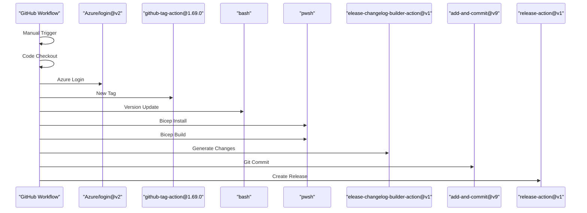

# Continuous Workflows

A number of CI workflows are leveraged in this repo to test the bicep files to ensure quality is high. The attempt is to use good patterns and practices while working with Infrastructure as Code.

### Pre-deploy Validation

It's essential to catch as many problems before a single resource is deployed to real infrastructure. There are a lot of tools and techniques that can be leveraged to catch functional or syntactical problems.

![[1]][1]

#### PSRule for Azure

An interesting project for performing pre/post validation of Azure Resources against the [Well Architected Framework](https://learn.microsoft.com/en-us/azure/architecture/framework/) is [PSRule for Azure](https://azure.github.io/PSRule.Rules.Azure/). Over [200 rules](https://azure.github.io/PSRule.Rules.Azure/en/baselines/Azure.All/) will be evaluated against the Arm template, ranging from Security configuration to naming conventions.

#### Using the AZ CLI to verify

As a minimum bar to assert the quality of the bicep code we really want to leverage some additional validation of "would this deploy successfully" and "what will this create", but without actually creating any actual Infrastructure resources.

To do this we need to talk to the Azure Control Plane, so we'll need an Azure Application with Federated OIDC, an Azure Subscription with RBAC for the Azure Application configured with a resource group.

1. [Validation](https://docs.microsoft.com/en-us/cli/azure/deployment/group?view=azure-cli-latest#az_deployment_group_validate). Validation ensures the template compiles, that there are no errors in the bicep code, that the parameter file provides all mandatory parameters and that the ARM Control plane will accept the deployment.

1. [What-If](https://docs.microsoft.com/en-us/azure/azure-resource-manager/templates/deploy-what-if). The what-if operation shows how resources will change if the template is deployed.

After running a What-If, we have the opportunity to leverage the output of the WhatIf to assert a level of quality of what's been written. This is especially useful when the bicep template contains a lot of conditional logic. EG. If you're using parameter values to choose whether or not to install certain resources it can be especially useful to write a couple of test cases around this.

There might also be a number of rules specific that we may want to enforce to guide best practices that cannot be done using [Azure Policy](https://docs.microsoft.com/en-us/azure/governance/policy/overview), such as resource naming conventions.

### Deploying to an Azure Subscription

By running the Validation and WhatIf, we've already have achieved a good level of rigour on quality, however there are gaps (Key Vault soft delete, Diagnostic Setting category validation, to name but two) with these validation tests - and the only way to know for sure if the template works is to deploy it.

Actually deploying the IaC template as part of the development process also supports;

- Enabling integration tests for more complex infrastructure deployments.
- Documented evidence of the IaC working with associated logs, great for future analysis if things break.
- Seeing the end to end time it takes to deploy, so we can provide guidance to the those who consume thetemplate.

In this repo we run a real deployment and integration tests daily on a schedule, as well as on every push to the main branch.

### Post-deploy Validation

The fact that a deployment completes successfully is a great sign, however there are several post deployment checks that should be run to verify the usability of the IaC code that's been new'd up.

In this case we are installing software and we are testing the software is installed.

## Solution actions used in this repo

![[0]][0]

#### Infra - Test

This action will run a Validate Step to ensure any changes to bicep is acceptable. It also will trigger a Standards Check that is non blocking in order to determine if the solution passes the PSRule checks.

#### Infra - Build

This action ensures that the bicep can build properly.

#### Infra - Release

The release action will run whenever a release is created to ensure we have a copy of the ARM template from that release that could then be used by other systems as necessary.

<!--- https://diagrams.helpful.dev/ --->

#### Auto - Doc

This action performs two main functions:

1. It runs a _spell check_ on any `.md` files in the repo. This is useful for catching simple mistakes from quick edits or other people's PRs. This spell check is part of the branch policy for merging to main.

2. It automatically compiles and deploys the documentation to the gh-pages site. This ensures that the documentation is always up-to-date with the latest changes in the main branch.

The action is triggered on pull requests that modify markdown files, pushes to the main branch that affect the docs/src directory, and can also be run manually from the Actions tab. This comprehensive approach helps maintain high-quality, current documentation for the project.

#### Auto - Greet

This is an auto action for a bot to reply to open issues and open pull requests.

#### Auto - Label

This is an auto action for a bot to automatically apply labels based on detection of type of code change.

[0]: src/images/pipeline_1.png "Pipeline Diagram"
[1]: src/images/pipeline_2.png "Pipeline Diagram"