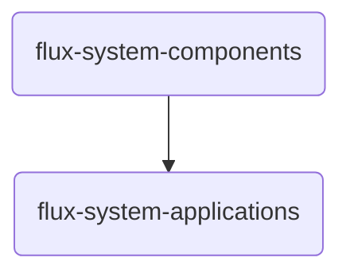
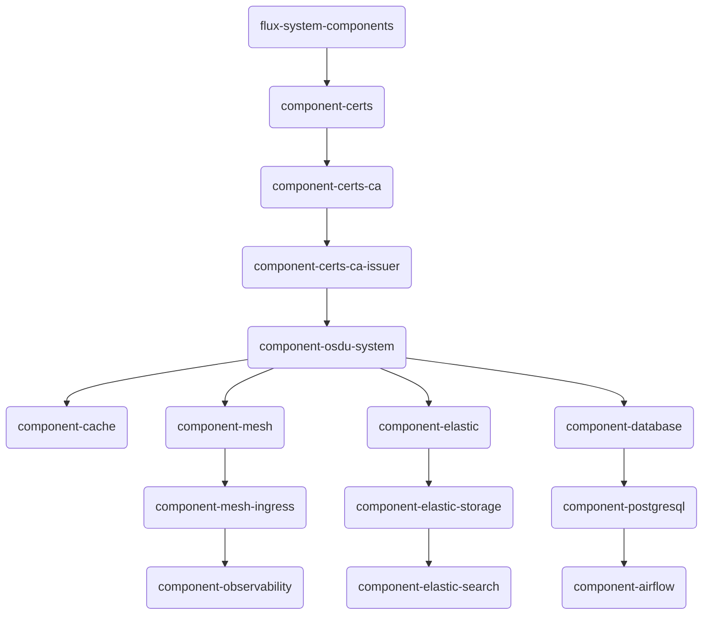
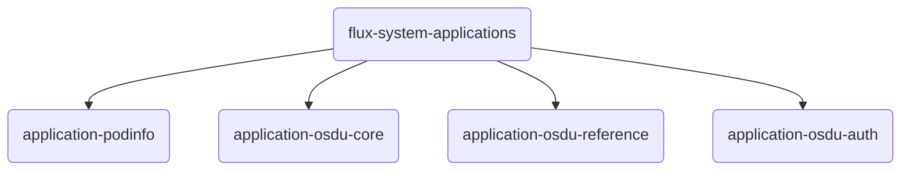

# Software Management with a GitOps Approach

In this solution, we utilize a **GitOps** approach for efficient and reliable software management. This method leverages a git repository as the source of truth for defining and updating the software within the cluster and comes with some distinct advantages.

- **Consistency and Standardization**: Ensures consistent configurations across different environments, minimizing discrepancies.
  
- **Audit Trails**: Every change is recorded in Git, providing a clear audit trail for accountability and traceability.
  
- **Rollbacks and Recovery**: Allows for easy rollbacks to previous configurations in case of errors or issues.
  
- **Enhanced Security**: Changes are reviewed through pull requests, increasing security and promoting collaboration among team members.

Software definitions are defined in this repository alongside the IaC and employ a customized [repo-per-team](https://fluxcd.io/flux/guides/repository-structure/#repo-per-team) pattern along with customized Helm charts.

- **Configuration Files**: YAML files that define the desired state of our components and applications.
  
- **Charts**: Helm charts used for defining, installing, and upgrading Kubernetes applications.

Our GitOps approach not only standardizes and secures the software management process but also **simplifies the deployment process**. By making it easier to maintain and update configurations, this approach ensures that deployments are both efficient and flexible. It allows for seamless integration of additional software configurations by pointing to alternate repositories that host these configurations. This extensibility enables our deployments to include not just the default software load but also any additional components required by our architecture.


### Stamp Layout

In our software architecture design, we define two primary software Kustomizations that describe a **stamp**. A Kustomization is a Flux resource representing a set of defined manifests that Flux should reconcile to the cluster, with dependencies between them. Structuring our Kustomizations this way ensures clarity and separation of concerns, making it easier to manage and organize both components and applications.

1. **Components**: Middleware layers that provide essential services to the platform, necessary to support OSDU Services.
2. **Applications**: The OSDU platform services themselves, organized into logical groups of capabilities.




```bash
├── applications
│   └── kustomize.yaml
└── components
    └── kustomize.yaml
```

 

### Components Structure

The Components directory is organized to facilitate the management of various middleware layers essential for our infrastructure. Below is the layout:

Components are organized to facilitate the logical understanding of the middleware software installations.  Components have dependency structures in the sequence of configuration.  A naming pattern is used to help facilitate understanding.



```bash
── components
    ├── certs
    │   ├── namespace.yaml
    │   ├── release.yaml
    │   └── source.yaml
    ├── certs-ca
    │   └── certificate.yaml
    ├── certs-ca-issuer
    │   └── issuer.yaml
    ├── database
    │   ├── namespace.yaml
    │   ├── postgresql.yaml
    │   └── vault-secrets.yaml
    ├── elastic-search
    │   ├── elastic-job.yaml
    │   ├── elastic-search.yaml
    │   ├── kibana.yaml
    │   ├── namespace.yaml
    │   └── vault-secrets.yaml
    ├── elastic-storage
    │   └── storage-class.yaml
    ├── mesh-ingress
    │   └── gateway.yaml
    ├── observability
    │   ├── grafana.yaml
    │   ├── jaeger.yaml
    │   ├── kiali.yaml
    │   ├── loki.yaml
    │   ├── prometheus.yaml
    │   └── subnet_monitoring.yaml
    └── osdu-system
        ├── airflow.yaml
        ├── cache.yaml
        ├── database.yaml
        ├── elastic.yaml
        ├── mesh.yaml
        ├── namespace.yaml
        └── reloader.yaml
```

__Applications Structure__

The Applications directory is organized to facilitate the management of applications that are installed in the platform. 




```bash
── applications
│   ├── osdu-auth
│   │   ├── namespace.yaml
│   │   └── release.yaml
│   ├── osdu-core
│   │   ├── README.md
│   │   ├── base.yaml
│   │   ├── entitlements.yaml
│   │   ├── file.yaml
│   │   ├── indexer.yaml
│   │   ├── legal.yaml
│   │   ├── namespace.yaml
│   │   ├── partition.yaml
│   │   ├── schema.yaml
│   │   ├── search.yaml
│   │   ├── storage.yaml
│   │   └── user-init.yaml
│   ├── osdu-reference
│   │   ├── base.yaml
│   │   ├── crs-catalog.yaml
│   │   ├── crs-conversion.yaml
│   │   ├── namespace.yaml
│   │   └── unit.yaml
│   └── podinfo
│       ├── ingress.yaml
│       ├── namespace.yaml
│       ├── release.yaml
│       └── source.yaml
```

