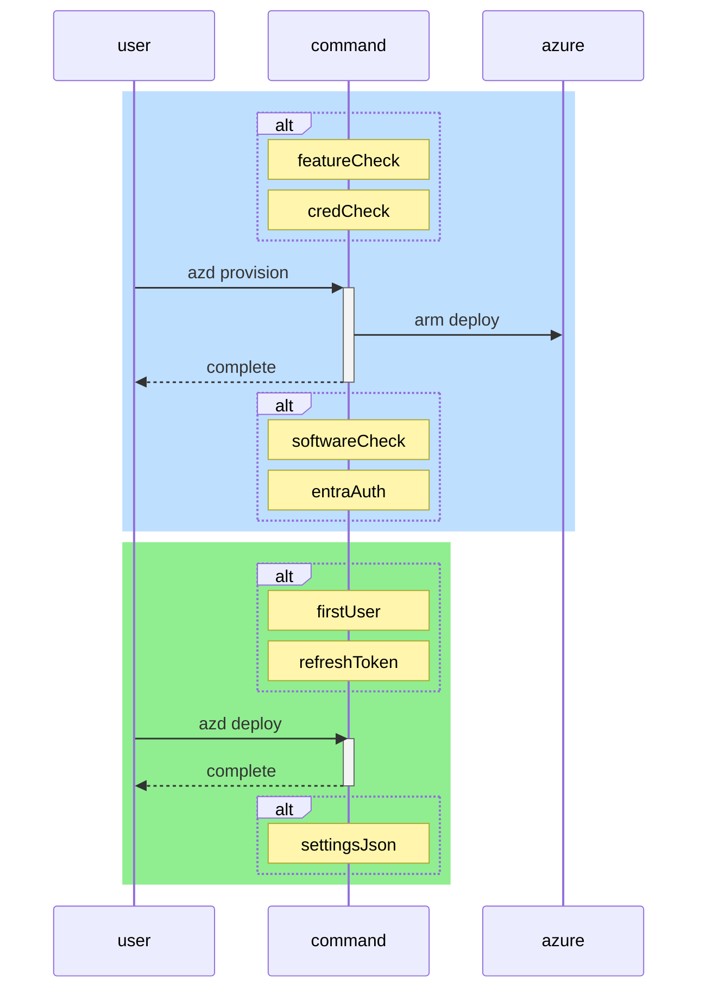

# Architecture

!!! Hint
    The developer sandbox is built using the following principles from the Azure Well-Architeced Framework.
    For a deeper understanding, we recommend reading our article on the Micosoft Learn
    [Azure Well-Architected Framework](https://learn.microsoft.com/en-us/azure/well-architected/),
    which provides valuable insights into best practices and design
    considerations for azure workloads.

**Cost Optimization** - Creating a cost-effective solution while balancing security.

**Security** - Enhancing security within a development context, adhering to a zero trust model.

**Operational Excellence** - Prioritizing DevOps standards with automation to ensure efficient operations and robust monitoring.

#### Desired State Configuration

Bicep is a domain-specific language (DSL) for deploying Azure resources declaratively. It simplifies authoring ARM templates and allows you to define the desired state of your Azure infrastructure in code. Azure Resource Manager (ARM) processes the Bicep file to ensure the Azure environment matches the defined desired state, correcting any drift through redeployment.

!!! Note
    Microsoft recommends when developing with Bicep to use the official [Azure Verified Modules](https://azure.github.io/Azure-Verified-Modules/).

#### Desired State Management

GitOps uses Git as a single source of truth for declarative components and applications. It ensures that the actual state of the components or application matches the desired state defined in the Git repository, automating updates through continuous monitoring and Git commits.

# Sequence Diagram

This diagram documents how the interactions work for the Azure CLI Developer Command Structures

<!--- https://diagrams.helpful.dev/ --->

# Infrastructure

The architecture diagram below provides a visual representation of the infrastructure when deployed. It's designed to help you understand the various components and how they interact within the Azure environment.

![[0]][0]

## Key Components Illustrated in the Diagram:

1. Azure Virtual Network: Illustrates the default network design.
2. Kubernetes Node Pools: Illustrate the design of the cluster nodepools.
3. Storage Resources: Illustrates how Storage Accounts and Cosmos Databases are connected to the network.
4. Ingress Load Balancers: Illustrates how the Load Balancers created by Istio Gateways are to the network.

## Software Management with a Gitops Approach

In this workspace, we utilize a GitOps approach for efficient and reliable software management. This method leverages this Git repository as the source of truth for defining and updating the software configurations and deployments within the infrastructure.

### GitOps Configuration

Our GitOps configuration resides in this Git repository and uses a customized [repo-per-team](https://fluxcd.io/flux/guides/repository-structure/#repo-per-team) pattern. This repository includes:

- **Configuration Files**: YAML files defining the desired state of our components and applications.

- **Charts**: Helm charts used for defining, installing, and upgrading Kubernetes applications.

### Advantages of GitOps

- **Consistency and Standardization**: Ensures consistent configurations across different environments.
- **Audit Trails**: Every change is recorded in Git, providing a clear audit trail.
- **Rollbacks and Recovery**: Every change is recorded in Git, providing a clear audit trail.
- **Enhanced Security**: Changes are reviewed through pull requests, increasing security and collaboration.

Our GitOps approach simplifies the process of deploying and managing software, making it easier to maintain and update, as well as providing a configurable way of leveraging other software configurations by pointing to alternate repositories hosting other configurations. By leveraging this method, we ensure that our deployments can be extended to things that not only include the default software load.

[0]: images/architecture.png "Architecture Diagram"
