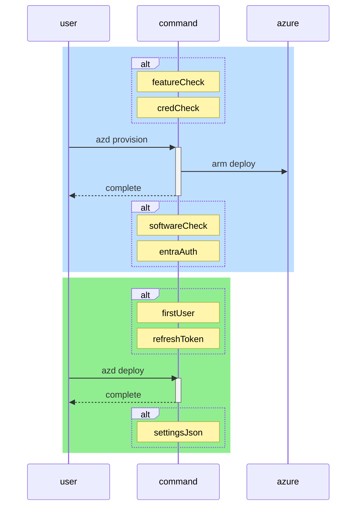

# Architecture

Personal OSDU™ instances are built using principles from the Azure Well-Architected Framework which provide a set of best practices and design considerations for azure workloads.

??? Tip "Learning Opportunity"
    
    For a deeper understanding read about the
    [Azure Well-Architected Framework](https://learn.microsoft.com/en-us/azure/well-architected/).
    

#### IaC: Declarative Resource Definition

Infrastructure as Code (IaC) uses declarative definitions to specify the desired state of cloud resources. Bicep is a domain-specific language (DSL) used for deploying Azure resources declaratively. It simplifies authoring ARM templates and allows you to define the desired state of your Infrastructure as Code (IaC). Azure Resource Manager (ARM) processes the Bicep file to ensure the Azure environment matches the defined desired state, correcting any drift through redeployment.

??? Tip "Learning Opportunity"

    Understand Bicep development with the official [Azure Verified Modules](https://azure.github.io/Azure-Verified-Modules/).

#### GitOps: Declarative Configuration Management

[GitOps](https://opengitops.dev) a term introduced by [WeaveWorks](https://www.weave.works/blog/the-history-of-gitops_) uses declarative configurations like Kustomize configs, Helm charts to manage software. Instead of scripting everything manually, GitOps uses a set of declarative configuration files that define a software desired state.

GitOps uses versioned CI/CD on top of a declarative infrastructure, allowing developers to "[stop scripting and start shipping](https://twitter.com/kelseyhightower/status/953638870888849408)," as Kelsey Hightower put it. This declarative configuration is helpful to define the entire softwarestack as code and continuously deliver changes with confidence to environments.

??? Tip "Learning Opportunity"

    Dive Deeper into [GitOps for Azure Kubernetes Service](https://learn.microsoft.com/en-us/azure/architecture/example-scenario/gitops-aks/gitops-blueprint-aks).

## CLI Command Sequencing

The Azure Developer CLI (azd) provides a set of commands to provision and deploy resources to Azure. These commands offer the ability to include hooks to inject custom logic into the deployment process.  This custom logic is written with powershell scripts to ensure cross-platform compatability.

This sequence diagram illustrates the interactions within the Azure CLI developer command structures.

<!--- https://diagrams.helpful.dev/ --->

## Azure Infrastructure Diagram

This diagram provides a broad visual representation of the infrastructure as deployed. It is intended to help illustrate the various components and interactions within Azure.

![[0]][0]

### Resource Catagories

-   :material-lan:{ .lg .middle } __Azure Virtual Network__

    ---

    Illustrate the default network design.

-   :material-kubernetes:{ .lg .middle } __Kubernetes Node Pools__

    ---

    Illustrate the design for the cluster nodepools.

-   :material-database:{ .lg .middle } __Storage Resources__

    ---

    Illustrate how Storage Accounts and Cosmos Databases connect to the network.

-   :material-server-network:{ .lg .middle } __Ingress Load Balancers__

    ---

    Illustrate how the Load Balancers created by Istio Gateways are available in the network.

## Software

This workspace utilizes a GitOps approach for efficient and reliable software management. This method leverages a Git repository as the source of truth for defining and updating software configurations and deployments within the infrastructure.

### GitOps Configuration

A GitOps configuration resides in this Git repository and uses a gitops repository pattern. This repository includes:

-   :material-file-cog:{ .lg .middle } __Configuration Files__

    ---

    YAML files defining the desired state of our components and applications.

-   :material-package-variant-closed:{ .lg .middle } __Charts__

    ---

    Helm charts used for defining, installing, and upgrading Kubernetes applications.

??? Tip "Learning Opportunity"

    Understand more about the [repo-per-team](https://fluxcd.io/flux/guides/repository-structure/#repo-per-team) pattern.

### GitOps Advantages

A GitOps approach simplifies the process of deploying and managing software, making it easier to maintain and update, as well as providing a configurable way of leveraging other software configurations by pointing to alternate repositories hosting other configurations. By leveraging this method, we ensure that our deployments can be extended to things that not only include the default software load.

-   :material-sync:{ .lg .middle } __Consistency and Standardization__

    ---

    Ensures consistent configurations across different environments.

-   :material-history:{ .lg .middle } __Audit Trails__

    ---

    Every change is recorded in Git, providing a clear audit trail.

-   :material-backup-restore:{ .lg .middle } __Rollbacks and Recovery__

    ---

    Easily revert to previous states if issues arise, enhancing system reliability.

-   :material-shield-check:{ .lg .middle } __Enhanced Security__

    ---

    Changes are reviewed through pull requests, increasing security and collaboration.

[0]: images/architecture.png "Architecture Diagram"