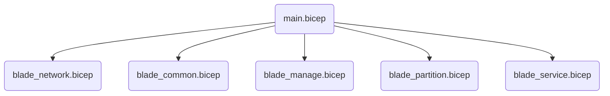

# Infrastructure

The OSDU™ private instance design utilizes a stamp-based architecture, enabling independent deployment of stamps with varying configurations. This approach allows linear scaling to accommodate multiple deployments across tenants.

??? Tip "Learning Opportunity"

    For more information on the Deployment Stamp Pattern, refer to the [Azure Architecture Center](https://learn.microsoft.com/en-us/azure/architecture/patterns/deployment-stamp).

The Infrastructure as Code (IaC) implementation consists of a main bicep file with custom bicep pattern modules. These modules, referred to as `blades`, are organized based on logical groupings of resources. The IaC leverages Azure Verified Modules, which are versioned, reusable, microsoft supported modules that adhere to best practices for deploying specific Azure resources.

??? Tip "Learning Opportunity"
    For more details on Bicep Pattern Modules, consult the [Azure Verified Modules documentation](https://azure.github.io/Azure-Verified-Modules/indexes/bicep/bicep-pattern-modules/).

## Key Concepts

<div class="grid cards" markdown>

- :material-file-tree:{ .lg .middle } __Solution__: Entry point for infrastructure deployment
- :material-view-grid-outline:{ .lg .middle } __Blades__: Logical groupings of related resources
- :material-puzzle-outline:{ .lg .middle } __Modules__: Azure verified components for specific resources

</div>



## Main Solution

The `main.bicep` file orchestrates the entire infrastructure deployment by importing and calling other modules (blades) to create a complete stamp. Key components include:

### Parameters

User provided values for use during the deployment of the solution.  These values can define different configuraiton blocs for things like identity, network, cluster, software, and feature flags.


```javascript title="Sample Parameters"
@description('Use customized server types.')
param customVMSize string = ''

@allowed([
  'External'
  'Internal'
  'Both'
  ''
])
@description('Specify the Ingress type for the cluster.')
param ingressType string = 'External'

@description('Feature Flag: Enable Storage accounts public access.')
param enableBlobPublicAccess bool = false
```

### Variables

Declares internal configuration settings and logic decision drivers or naming conventions.

```javascript title="Sample Variables"
@description('Feature Flag: Enable Telemetry')
var enableTelemetry = false

@description('Feature Flag to Enable Private Link')
var enablePrivateLink = false

@description('Optional. Customer Managed Encryption Key.')
var cmekConfiguration = {
  kvUrl: ''
  keyName: ''
  identityId: ''
}
```

Configuration objects (constants) are frequentlydefined as variables for easy maintenance:

```javascript title="Sample Configuration Object"
var configuration = {
  name: 'main'
  displayName: 'Main Resources'
  logs: {
    sku: 'PerGB2018'
    retention: 30
  }
  partitions: [
    {
      name: 'opendes'
    }
  ]
}
```

### Resources

Deploys resources using a combination of approaches:

1. Direct resource declarations in the main Bicep file
2. Custom modules developed for specific functionalities
3. Versioned Bicep modules from the Azure Verified Modules (AVM) registry

This flexible approach allows for efficient resource management and deployment:

```javascript title="Sample Module"
module logAnalytics 'br/public:avm/res/operational-insights/workspace:0.3.4' = {
  name: '${configuration.name}-log-analytics'
  params: {
    name: rg_unique_id
    location: location
    enableTelemetry: enableTelemetry
  }
}
```

### Outputs

Exposes important information for use in the CLI environment:

```javascript title="Sample Output"
output logAnalyticsWorkspaceId string = logAnalytics.outputs.workspaceId
```

## Blades

Blades are organized to facilitate the logical understanding of the infrastructure components. Each blade is responsible for a specific aspect of the infrastructure and depend on other blades. Here's an overview of the blade structure:

<div class="grid cards" markdown>

- :material-lan:{ .lg .middle } __Network Blade__

    ---

    Manages all networking-related resources, including virtual networks, subnets, and network security groups.

- :material-share-variant:{ .lg .middle } __Common Blade__

    ---

    Deploys shared resources used across the infrastructure, such as Key Vault, Storage Accounts, and monitoring services.

- :material-desktop-tower-monitor:{ .lg .middle } __Manage Blade__

    ---

    Handles management-related resources like virtual machines and bastion hosts for secure remote access.

- :material-database:{ .lg .middle } __Partition Blade__

    ---

    Manages data partitioning resources, including storage accounts and databases for each partition.

- :material-kubernetes:{ .lg .middle } __Service Blade__

    ---

    Deploys service-specific resources like AKS clusters, container registries, and application gateways.

</div>


!!! abstract "Blade Dependencies"

    ```mermaid
    flowchart TD
        subgraph MainBicep ["main.bicep"]
            direction LR
            IdentityResources("identity_resources")
            MonitoringResources("monitoring_resources")
            IdentityResources --> MonitoringResources
        end
        direction TB
        MainBicep --> BladeNetwork("blade_network.bicep")
        BladeNetwork --> BladeCommon("blade_common.bicep")
        BladeCommon --> BladeManage("blade_manage.bicep")
        BladeCommon --> BladePartition("blade_partition.bicep")
        BladeCommon --> BladeService("blade_service.bicep")
        BladePartition --> BladeService
    ```

### Resources

Each blade is responsible for creating and managing specific Azure resources. Below is an overview of the primary resources deployed by each blade:


!!! abstract "Network Blade - blade_network.bicep"

    ```mermaid
    graph TD
        ConditionalNetwork["Network Resources: Conditional Deployments"]
        ClusterNSG["clusterNetworkSecurityGroup - !vnetInjection"]
        BastionNSG["bastionNetworkSecurityGroup - !vnetInjection and enableBastion"]
        MachineNSG["machineNetworkSecurityGroup - !vnetInjection and enableBastion"]
        Network["network - !vnetInjection"]
        CommonResources["Common Resources"]
        ConditionalNetwork -->|"!vnetInjection"| ClusterNSG
        ConditionalNetwork -->|"!vnetInjection and enableBastion"| BastionNSG
        ConditionalNetwork -->|"!vnetInjection and enableBastion"| MachineNSG
        ConditionalNetwork -->|"!vnetInjection"| Network
        ClusterNSG --> CommonResources
        BastionNSG --> CommonResources
        MachineNSG --> CommonResources
        Network --> CommonResources
    ```
!!! abstract "Common Blade - blade_common.bicep"

    ```mermaid
    graph TD
        CommonResources["Common Resources"]
        AppInsights["appInsights"]
        KeyVault["keyVault"]
        KeyVaultSecrets["keyVaultSecrets"]
        ScriptSshKey["scriptSshKey"]
        ScriptCertificates["scriptCertificates"]
        CommonStorage["commonStorage"]
        ScriptFileShares["scriptFileShares"]
        CommonDatabase["commonDatabase"]
        RedisCache["redisCache"]
        CommonResources --> RedisCache
        CommonResources --> AppInsights
        CommonResources --> KeyVault
        KeyVault --> KeyVaultSecrets
        KeyVault --> ScriptSshKey
        KeyVault --> ScriptCertificates
        KeyVault --> CommonStorage
        CommonStorage --> ScriptFileShares
        KeyVault --> CommonDatabase
    
    ``` 

!!! abstract "Manage Blade - blade_manage.bicep"

    ```mermaid
    graph TD    
        ManageResources["Manage Resources"]
        BastionHost["bastionHost - enableBastion"]
        VirtualMachine["virtualMachine - enableBastion"]
        ManageResources -->|"enableBastion"| BastionHost
        BastionHost --> |"enableBastion"| VirtualMachine
    ```

!!! abstract "Partition Blade - blade_partition.bicep"

    ```mermaid
    graph TD
        PartitionResources["Partition Resources"]
        PartitionStorage["partitionStorage"]
        PartitionDatabase["partitionDatabase"]
        PartitionServiceBus["partitionServiceBus"]
        BlobUpload["blobUpload"]
        PartitionSecrets["partitionSecrets"]
        PartitionResources --> PartitionStorage
        PartitionResources --> PartitionDatabase
        PartitionResources --> PartitionServiceBus
        PartitionStorage --> BlobUpload
        PartitionServiceBus --> PartitionSecrets   
    ```

!!! abstract "Service Blade - blade_service.bicep"

    ```mermaid
    graph TD
        ServiceResources["Service Resources"]
        ContainerRegistry["containerRegistry"]
        KubernetesCluster["kubernetesCluster"]
        NodePool1["nodePool1"]
        NodePool2["nodePool2"]
        NodePool3["nodePool3"]
        FederatedIdentities["federatedIdentities"]
        RbacVaultStorage["rbacVaultStorage"]
        RbacPartitionStorage["rbacPartitionStorage"]
        AppConfiguration["appConfiguration"]
        AppConfigMap["appConfigMap"]
        HelmAppConfigProvider["helmAppConfigProvider"]
        FluxConfiguration["fluxConfiguration"]
        Prometheus["prometheus"]
        Grafana["grafana"]
        DeploymentScript["scriptAppConfigAuth"]
        ServiceResources --> ContainerRegistry
        ServiceResources --> KubernetesCluster
        KubernetesCluster --> NodePool1
        KubernetesCluster --> NodePool2
        KubernetesCluster --> NodePool3
        KubernetesCluster --> FederatedIdentities
        FederatedIdentities --> RbacVaultStorage
        FederatedIdentities --> RbacPartitionStorage
        RbacVaultStorage --> AppConfiguration
        RbacPartitionStorage --> AppConfiguration
        KubernetesCluster --> AppConfigMap
        AppConfiguration --> FluxConfiguration
        NodePool1 --> FluxConfiguration
        NodePool2 --> FluxConfiguration
        NodePool3 --> FluxConfiguration
        AppConfigMap --> HelmAppConfigProvider
        HelmAppConfigProvider --> FluxConfiguration
        FluxConfiguration -->|"enableMonitoring"| Prometheus
        Prometheus -->|"enableMonitoring"| Grafana
        ServiceResources --> DeploymentScript  
    ```