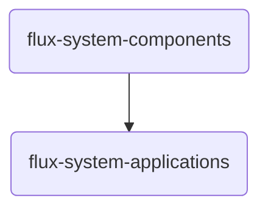
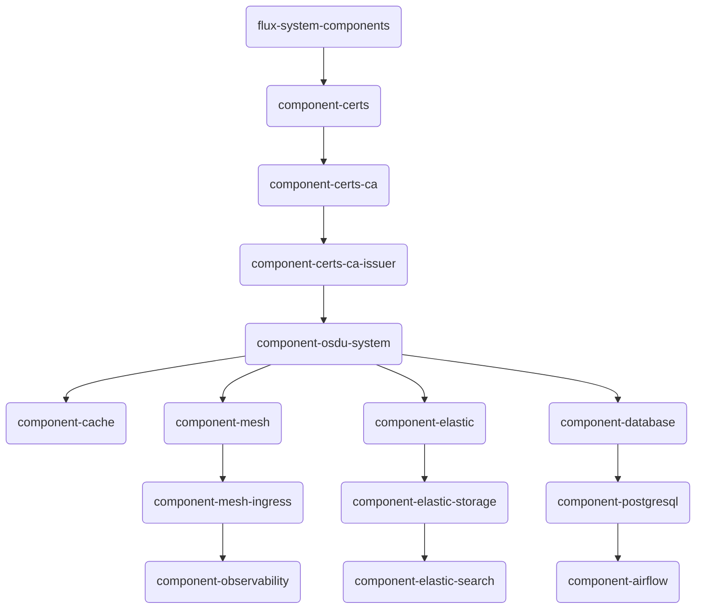
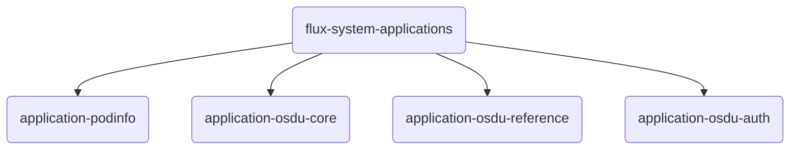
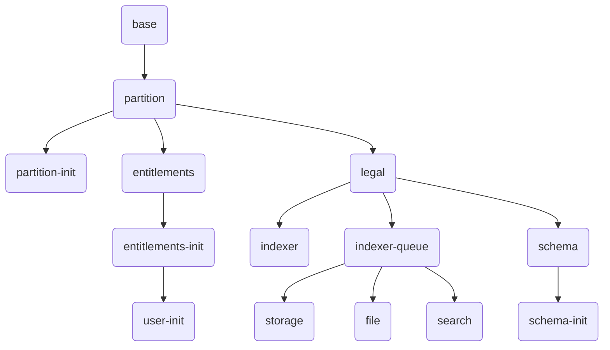
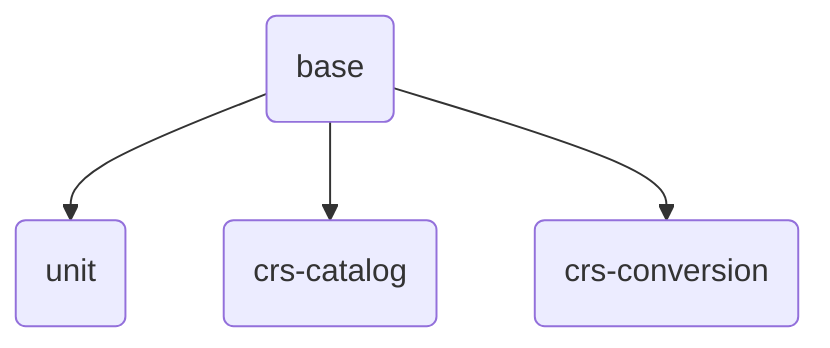

# Software Management

### Stamp Layout

In our software architecture design, we define two primary software Kustomizations that describe a **stamp**. A Kustomization is a Flux resource representing a set of defined manifests that Flux should reconcile to the cluster, with dependencies between them. Structuring our Kustomizations this way ensures clarity and separation of concerns, making it easier to manage and organize both components and applications.

1. **Components**: Middleware layers that provide essential services to the platform, necessary to support OSDU Services.
2. **Applications**: The OSDU platform services themselves, organized into logical groups of capabilities.




```bash
├── applications
│   └── kustomize.yaml
└── components
    └── kustomize.yaml
```

 

### Component Structure

The Components directory is organized to facilitate the management of various middleware layers essential for our infrastructure. Below is the layout:

Components are organized to facilitate the logical understanding of the middleware software installations.  Components have dependency structures in the sequence of configuration.  A naming pattern is used to help facilitate understanding.



```bash
── components
    ├── certs
    │   ├── namespace.yaml
    │   ├── release.yaml
    │   └── source.yaml
    ├── certs-ca
    │   └── certificate.yaml
    ├── certs-ca-issuer
    │   └── issuer.yaml
    ├── database
    │   ├── namespace.yaml
    │   ├── postgresql.yaml
    │   └── vault-secrets.yaml
    ├── elastic-search
    │   ├── elastic-job.yaml
    │   ├── elastic-search.yaml
    │   ├── kibana.yaml
    │   ├── namespace.yaml
    │   └── vault-secrets.yaml
    ├── elastic-storage
    │   └── storage-class.yaml
    ├── mesh-ingress
    │   └── gateway.yaml
    ├── observability
    │   ├── grafana.yaml
    │   ├── jaeger.yaml
    │   ├── kiali.yaml
    │   ├── loki.yaml
    │   ├── prometheus.yaml
    │   └── subnet_monitoring.yaml
    └── osdu-system
        ├── airflow.yaml
        ├── cache.yaml
        ├── database.yaml
        ├── elastic.yaml
        ├── mesh.yaml
        ├── namespace.yaml
        └── reloader.yaml
```

__Applications Structure__

The Applications directory is organized to facilitate the management of applications that are installed in the platform. 




```bash
── applications
│   ├── osdu-auth
│   │   ├── namespace.yaml
│   │   └── release.yaml
│   ├── osdu-core
│   │   ├── README.md
│   │   ├── base.yaml
│   │   ├── entitlements.yaml
│   │   ├── file.yaml
│   │   ├── indexer.yaml
│   │   ├── legal.yaml
│   │   ├── namespace.yaml
│   │   ├── partition.yaml
│   │   ├── schema.yaml
│   │   ├── search.yaml
│   │   ├── storage.yaml
│   │   └── user-init.yaml
│   ├── osdu-reference
│   │   ├── base.yaml
│   │   ├── crs-catalog.yaml
│   │   ├── crs-conversion.yaml
│   │   ├── namespace.yaml
│   │   └── unit.yaml
│   └── podinfo
│       ├── ingress.yaml
│       ├── namespace.yaml
│       ├── release.yaml
│       └── source.yaml
```

__OSDU Core Structure__

The OSDU Core application is organized to facilitate the management of the OSDU core platform services. Below is the layout:



```bash
── osdu-core
   ├── base.yaml
   ├── entitlements.yaml
   ├── file.yaml
   ├── indexer.yaml
   ├── legal.yaml
   ├── namespace.yaml
   ├── partition.yaml
   ├── schema.yaml
   ├── search.yaml
   ├── storage.yaml
   └── user-init.yaml
```

__OSDU Reference Structure__

The OSDU Reference application is organized to facilitate the management of the OSDU reference platform services. Below is the layout:



```bash
── osdu-reference
   ├── base.yaml
   ├── crs-catalog.yaml
   ├── crs-conversion.yaml
   ├── namespace.yaml
   └── unit.yaml
```