# Portal Template (ARM)

The solution is a native bicep solution and includes a transpiled ARM template from the latest release.  This ARM template can then be easily used as a custom template deployment.

### 1. Microsoft Entra App Create

The solution requires the use of an Application to be registered in Microsoft Entra.

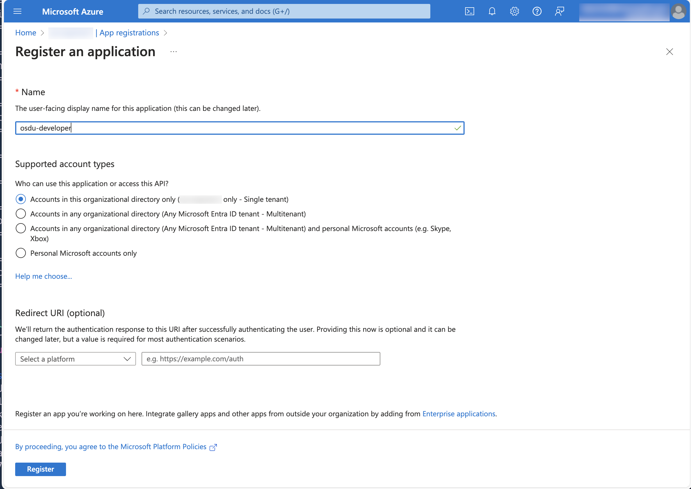

### 2. Microsoft Entra App Info

Create a new client secret to use and note the following IDs for the application.

- Application Client Id
- Application Client Principal Oid

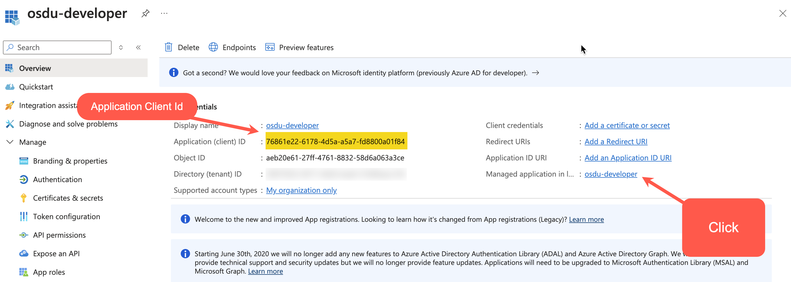
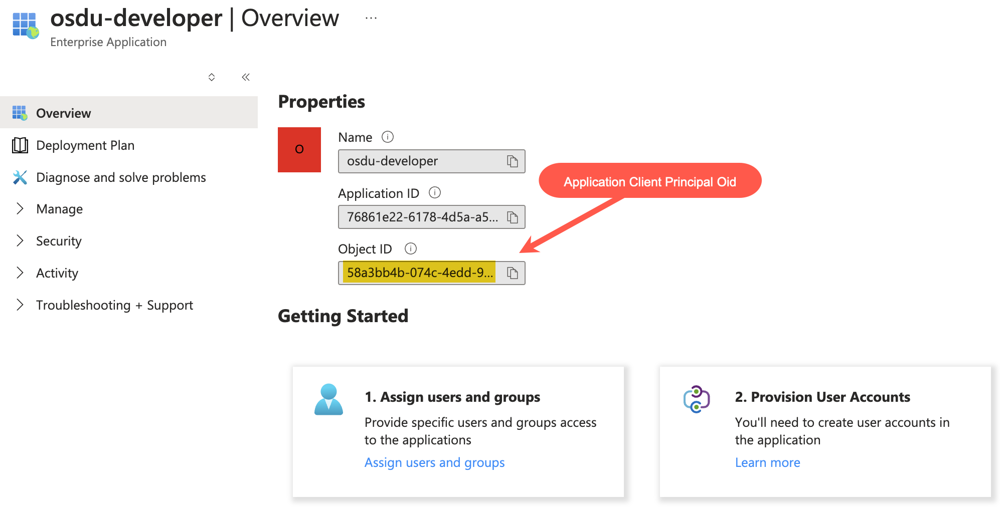

### 2. Deploy Solution

Click the `Deploy to Azure` button and fill out the required Parameters.

- Select the desired Subscription
- Select or create a new Resource Group
- Choose an Azure region to deploy into.

The following fields are mandatory fields to complete.

| **Field**    | **Description** |
|--------------|-----------------|
| Email Address | A valid email address for the first user in the Tenant. |
| Application Client Id | A valid GUID of the Entra Application Client Id|
| Application Secret | A valid Entra Application Secret |
| Application Client Principal Oid | A valid GUID for the Prinicpal Object Id |

Additional fields are all optional changes.  Please see feature flags for further details.

> Deployment will exceed 1 hour.

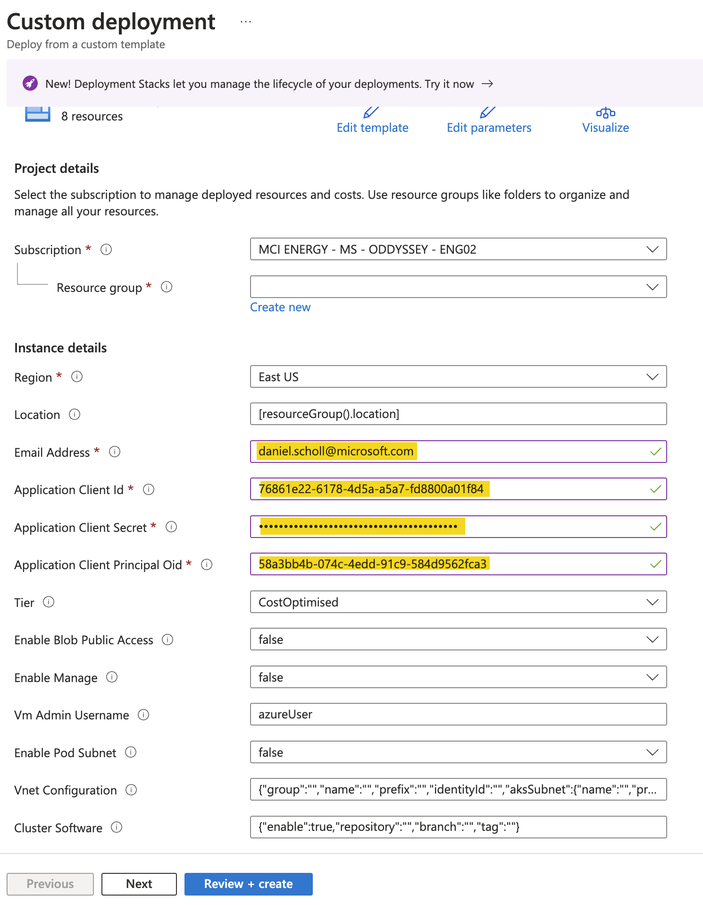

### 3. Validate Completion

Deployment is broken up into 2 parts, Infrastructure and Software.

Infrastructure deployment can be validated by investigating the deployments on the resource group. Success can be seen by having the main deployment details green.

Software deployment occurs after successful infrastructure and be seen by looking at the Azure Kubernetes Service gitops blade and observing software compliance.

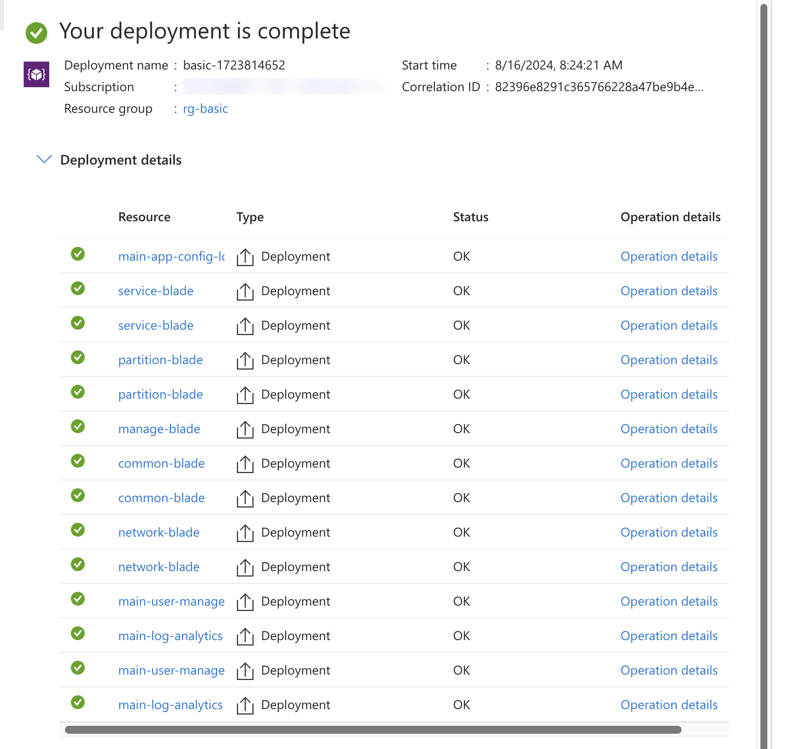
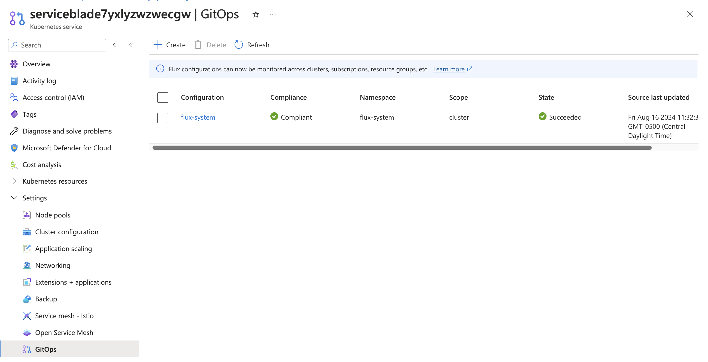

### 3. Microsoft Entra App Auth

Lookup the ingress IP address that has been configured under the kubernetes service `services and ingresses` blade and add the redirect uri to a spa platform on the application authentication blade.

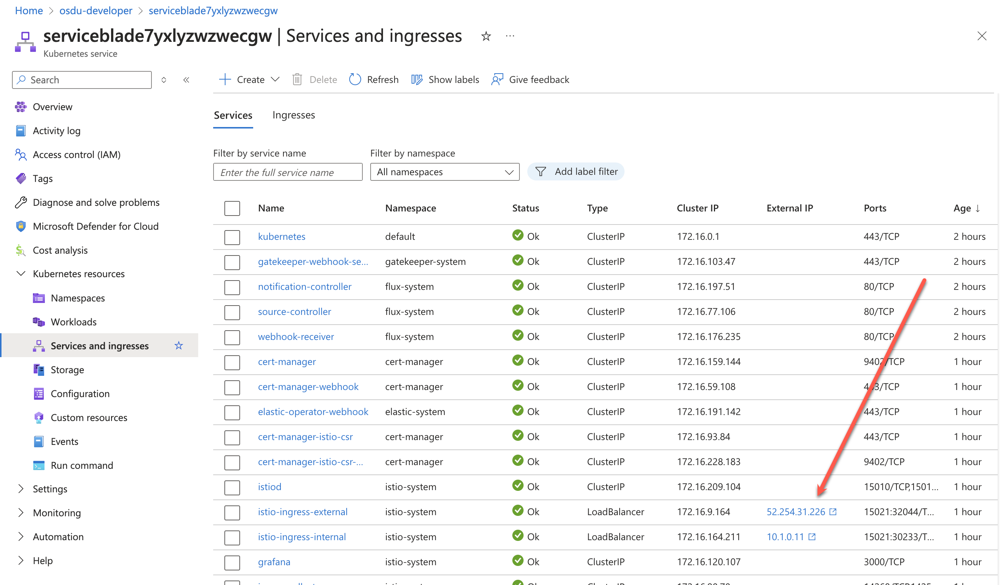
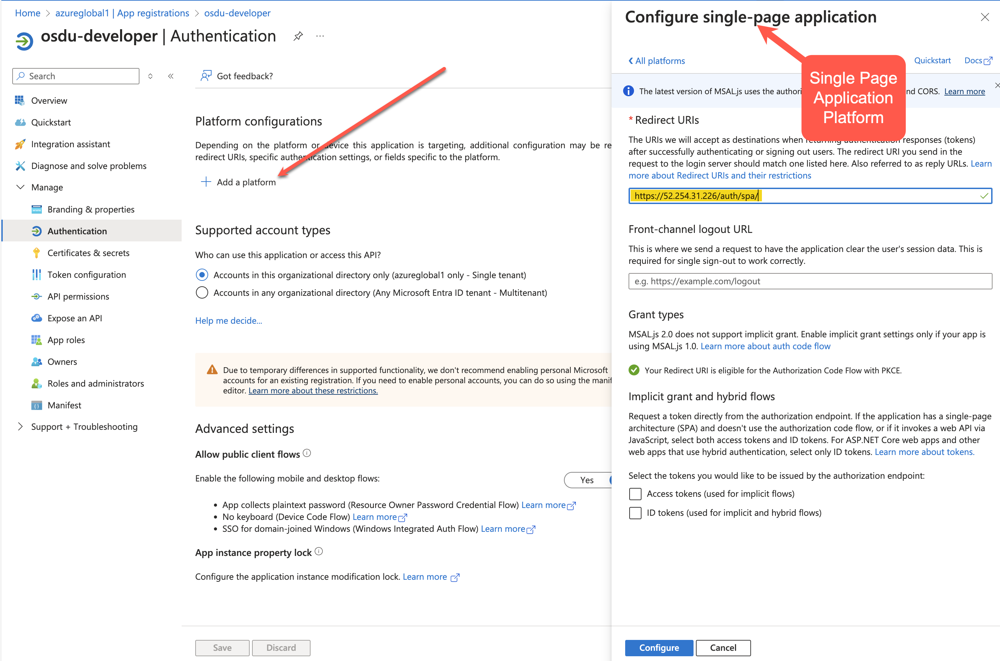

### 3. Retrieve Token

Using the form located at `https://<ip_address>/auth/spa/` retrieve a valid access token by clicking the Authorize button which will return an authorization code, then clicking the Get Tokens button which will retrieve a limited use access token.

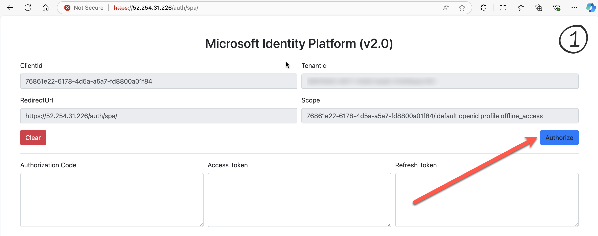
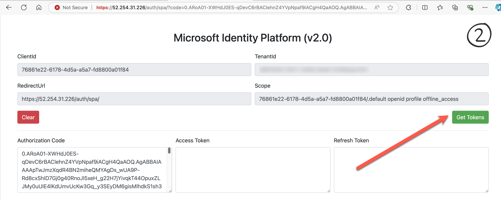
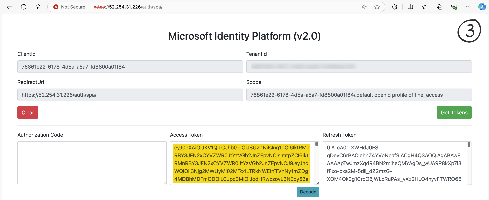

### 4. Execute API Requests

OSDU Services have swagger pages that are available.  Using the retrieved bearer token authenticate and execute API calls as desired.

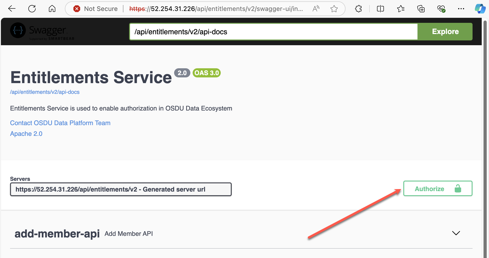
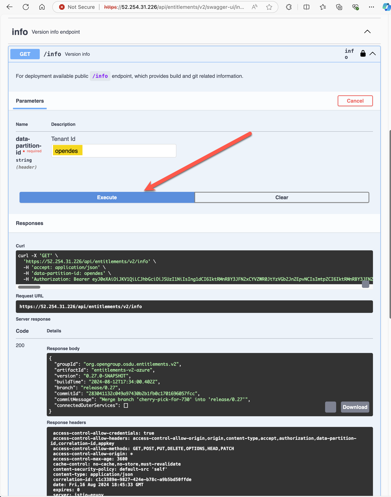