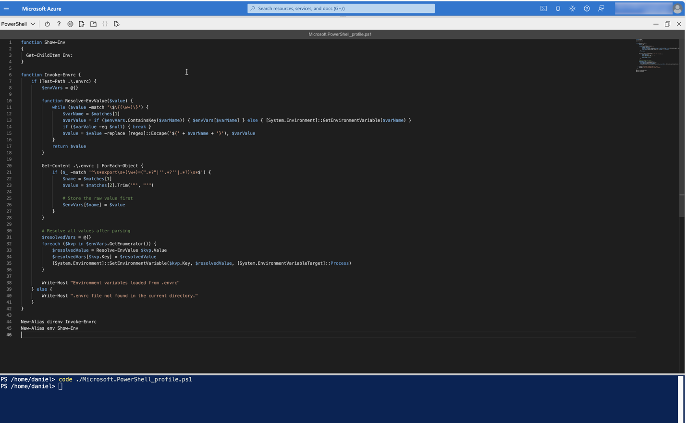
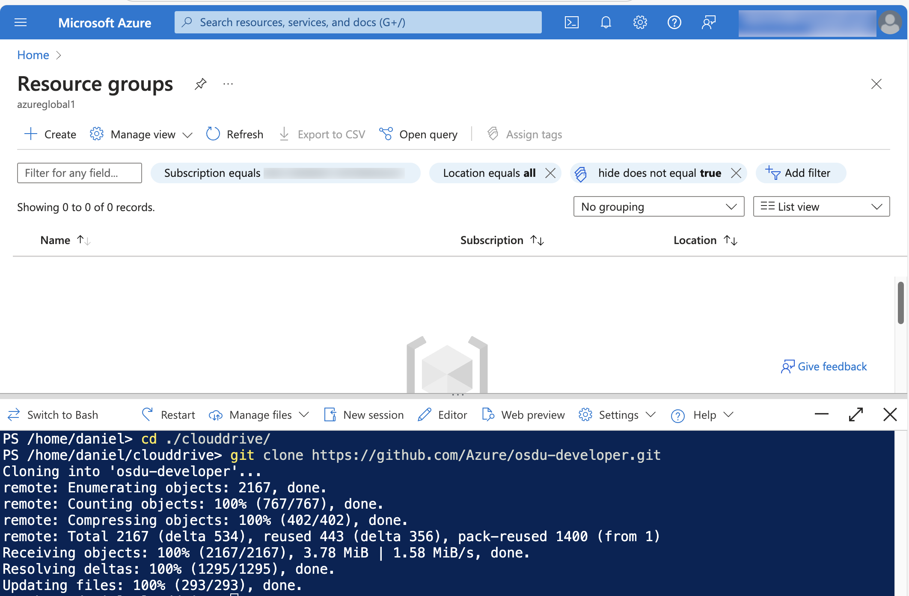
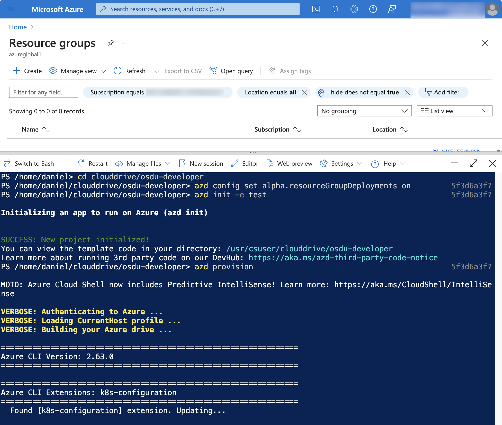
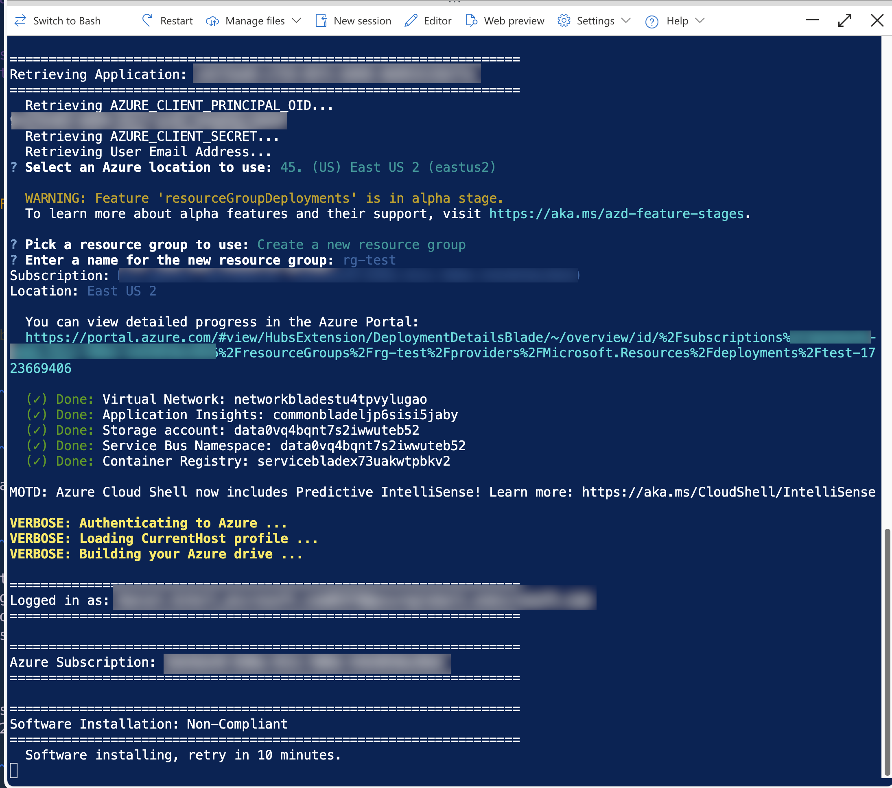

# Deploy using AZD

The process for working with the solution using the Azure Developer CLI is the recommended way for deployent offering the most flexibility.  This process can be used if working directly with the solution on a computer, working in a Visual Studio Code remote container, or using a cloud environment like Github Codespaces.

For ease of use this tutorial will leverage a cloud environment shell using Azure Cloud Shell.

It is recommended to use persistent files in Azure Cloud Shell for non-ephemeral sessions.

- [How to Use Azure Cloud Shell](https://learn.microsoft.com/en-us/azure/cloud-shell/new-ui-shell-window)
- [Persist Files in  Azure Cloud Shell](https://learn.microsoft.com/en-us/azure/cloud-shell/persisting-shell-storage)

In this tutorial you'll clone the osdu-developer repo to your clouddrive with Azure Cloud Shell, run a series of scripts to log into your subscription and deploy the solution, then verify the solution by running a few tests.

## Prepare a Cloud Shell Session before you Deploy the Solution

In this section you will create a Cloud Shell session, then modify your PowerShell profile in the session with inherent code required to run the deployment scripts.

### 1. Open a Cloud Shell session in Azure Portal

From <http://portal.azure.com> open an Azure Cloud Shell session in PowerShell, see [How to Use Azure Cloud Shell](https://learn.microsoft.com/en-us/azure/cloud-shell/new-ui-shell-window).  Run the following command:

```powershell
New-Item -Path $Profile -ItemType File -Force
```

### 2. Modify your PowerShell profile

Open the PowerShell code editor in your Azure portal by running the following command.

```powershell
code Microsoft.PowerShell_profile.ps1
```

### 3. Create a PowerShell profile for use with helper functions

Paste the following code into your Microsoft.PowerShell_profile.ps1 file.
Save, then restart the session.

```powershell
function Show-Env
{
  Get-ChildItem Env:
}

function Invoke-Envrc {
    if (Test-Path .\.envrc) {
        $envVars = @{}

        function Resolve-EnvValue($value) {
            while ($value -match '\$\{(\w+)\}') {
                $varName = $matches[1]
                $varValue = if ($envVars.ContainsKey($varName)) { $envVars[$varName] } else { [System.Environment]::GetEnvironmentVariable($varName) }
                if ($varValue -eq $null) { break }
                $value = $value -replace [regex]::Escape('${' + $varName + '}'), $varValue
            }
            return $value
        }

        Get-Content .\.envrc | ForEach-Object {
            if ($_ -match '^\s*export\s+(\w+)=(".*?"|''.*?''|.*?)\s*$') {
                $name = $matches[1]
                $value = $matches[2].Trim('"', "'")
                
                # Store the raw value first
                $envVars[$name] = $value
            }
        }

        # Resolve all values after parsing
        $resolvedVars = @{}
        foreach ($kvp in $envVars.GetEnumerator()) {
            $resolvedValue = Resolve-EnvValue $kvp.Value
            $resolvedVars[$kvp.Key] = $resolvedValue
            [System.Environment]::SetEnvironmentVariable($kvp.Key, $resolvedValue, [System.EnvironmentVariableTarget]::Process)
        }
        
        Write-Host "Environment variables loaded from .envrc"
    } else {
        Write-Host ".envrc file not found in the current directory."
    }
}

New-Alias direnv Invoke-Envrc
New-Alias env Show-Env
```



## Clone and Deploy the Solution

In this section you'll clone the osdu-developer repo into your clouddrive, then run a series of scripts to log into your subscription and deploy the solution.

### 1. Clone the Solution

Use a new Cloud Shell session and clone the repository.

```powershell
cd clouddrive
git clone https://github.com/Azure/osdu-developer.git
```



### 2. Deploy the Solution

Deploy the solution to your subscription answering any questions that may be presented.

> Deployment will exceed 1 hour.  It is common for a cloud session to timeout due to lack of activity. If a session times out executing `azd provision` again will continue the process.

```powershell
cd clouddrive/osdu-developer
az account set -s <your_subscription>
azd config set alpha.resourceGroupDeployments on
azd init -e <your_env_name>
azd provision
```





A successful deployment will result in a web page opening for the Identity Provider. Retrieve a one time use Authorization Code and set it for the environment.

## Verify your Deployment

### 1. Generate settings

```powershell
azd env set AUTH_CODE=<your_auth_code>
azd hooks run settings
```

### 2. Clone services and test

Clone the OSDU Services

```powershell
# Install the git repo manager tool
pip install gita

# Clone the repositories
gita clone -f src/core/repos
```

Load the environment variables necessary for successful test execution of your environment.

```powershell
cd src
direnv  # Execute the powershell function to initialize the environment values
```

Change to service directories and execute integration tests.

> The following is the pattern of how to test services.

```powershell
# Test Partition Service
cd src/core/partition/testing/partition-test-azure
mvn test

# Test Entitlement Service
cd src/core/entitilements/testing/entitlements-v2-test-azure
mvn test
```

## Clean up

After a deployment remove environment and delete the Azure Application that was created in Microsoft Entra. You can clean up your environments using scripts or manually through the Azure Portal.

### Option 1. Scripting Method

From the Azure Portal, run the following in your Azure Cloud Shell session.

```powershell
# Remove the resources
azd down --force --purge

# Remove the environment
rm .azure/<your_env_name>
```

### Option 2. Manual method

Manually delete the resources from the Azure Portal.

1. Remove the Azure Resource Group
1. Purge any Key Vaults or App Configuration Services
1. Delete the Azure Application from Microsoft Entra
1. Remove the cloned repository.