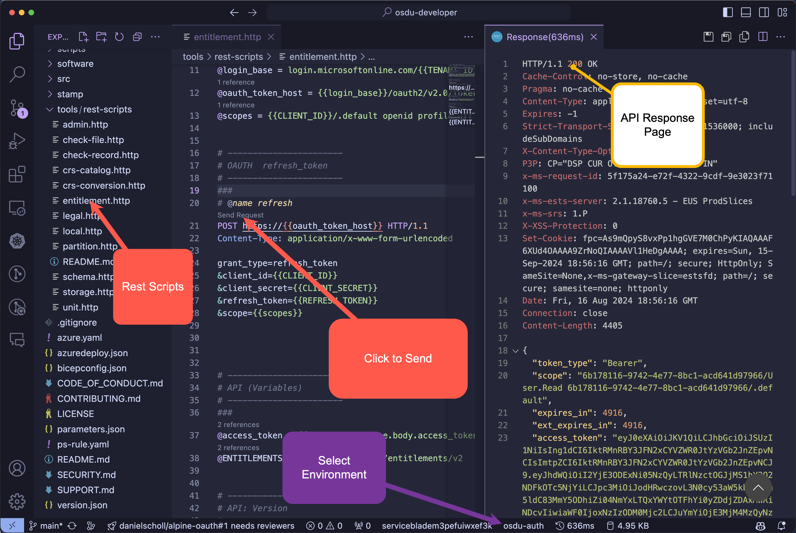

# Test using REST

The solution has an integrated capability for the immediate execution of Rest API's using visual studio code. This integration only occurs if the Azure Developer CLI installation process has been performed.

> Execution of `azd hooks run settings` is the command that configures the required integration for VSCode.

Execution of the REST Client Scripts requires installation of a [VS Code Extension](https://marketplace.visualstudio.com/items?itemName=humao.rest-client).

Locate the rest-scripts in the solution which holds a number of scripts that can be used to execute the API calls and sequence flows directly from within VSCode.  Each script typically has a sequence of API calls that can be executed from top to bottom to learn and understand the formats for calling the APIs or sequences necessary to execute to perform an action flow.

The following is an example of how to use these scripts.

