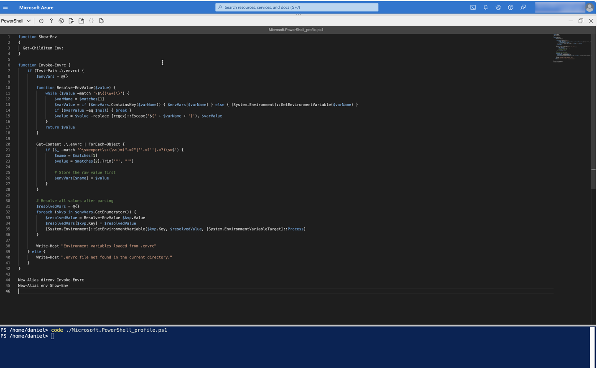
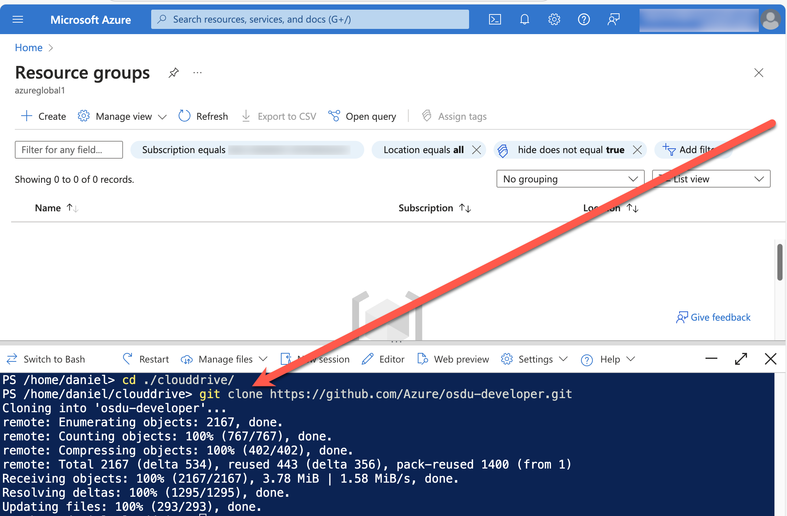
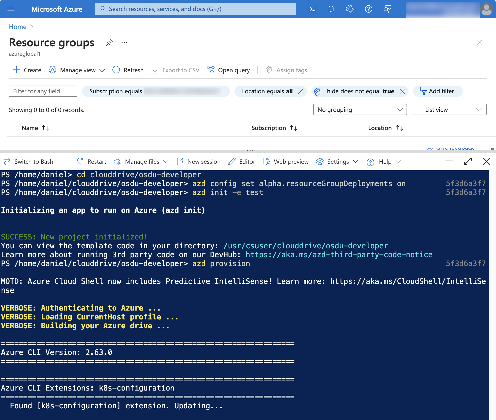
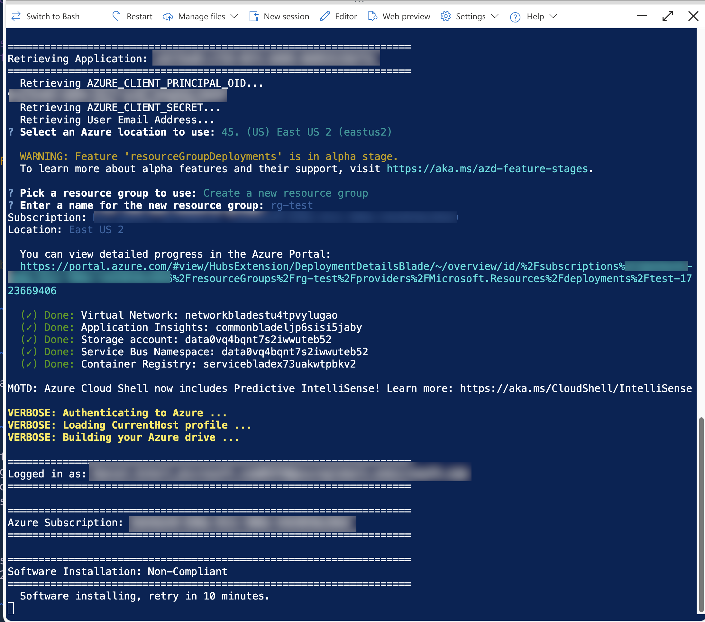

# How to deploy using the Azure Developer CLI

The process for working with the solution using the Azure Developer CLI is the recommended way for deployent offering the most flexability.  This process can be used if working directly with the solution on a computer, working in a Visual Studio Code remote container, or using a cloud environment like Github Codespaces.

For ease of use this tutorial will leverage a cloud environment shell using Azure Cloud Shell.

It is recommended to use persistent files in Azure Cloud Shell for non-ephemeral sessions.

- [How to Use Azure Cloud Shell](https://learn.microsoft.com/en-us/azure/cloud-shell/new-ui-shell-window)
- [Persist Files in  Azure Cloud Shell](https://learn.microsoft.com/en-us/azure/cloud-shell/persisting-shell-storage)

### 1. Prepare your Cloud Shell Environment

Create a PowerShell profile for use with helper functions and restart the session.

```powershell
# Create a Profile
New-Item -Path $Profile -ItemType File -Force

# Edit the Profile
code Microsoft.PowerShell_profile.ps1

# Add the following helper functions to the profile.
function Show-Env
{
  Get-ChildItem Env:
}

function Invoke-Envrc {
    if (Test-Path .\.envrc) {
        $envVars = @{}

        function Resolve-EnvValue($value) {
            while ($value -match '\$\{(\w+)\}') {
                $varName = $matches[1]
                $varValue = if ($envVars.ContainsKey($varName)) { $envVars[$varName] } else { [System.Environment]::GetEnvironmentVariable($varName) }
                if ($varValue -eq $null) { break }
                $value = $value -replace [regex]::Escape('${' + $varName + '}'), $varValue
            }
            return $value
        }

        Get-Content .\.envrc | ForEach-Object {
            if ($_ -match '^\s*export\s+(\w+)=(".*?"|''.*?''|.*?)\s*$') {
                $name = $matches[1]
                $value = $matches[2].Trim('"', "'")
                
                # Store the raw value first
                $envVars[$name] = $value
            }
        }

        # Resolve all values after parsing
        $resolvedVars = @{}
        foreach ($kvp in $envVars.GetEnumerator()) {
            $resolvedValue = Resolve-EnvValue $kvp.Value
            $resolvedVars[$kvp.Key] = $resolvedValue
            [System.Environment]::SetEnvironmentVariable($kvp.Key, $resolvedValue, [System.EnvironmentVariableTarget]::Process)
        }
        
        Write-Host "Environment variables loaded from .envrc"
    } else {
        Write-Host ".envrc file not found in the current directory."
    }
}

New-Alias direnv Invoke-Envrc
New-Alias env Show-Env
```



### 2. Clone the solution

Use a new cloudshell session and clone the repository.

```powershell
cd clouddrive
git clone https://github.com/Azure/osdu-developer.git
```




### 3. Deploy the solution

Deploy the solution to your subscription answering any questions that may be presented.

> Deployment will exceed 1 hour.  It is common for a cloud session to timeout due to lack of activity. If a session times out executing `azd provision` again will continue the process.

```powershell
cd clouddrive/osdu-developer
az account set <your_subscription>
azd config set alpha.resourceGroupDeployments on
azd init -e <your_env_name>
azd provision
```




A successful deployment will result in a web page opening for the Identity Provider. Retrieve a one time use Authorization Code and set it for the environment.


### 4. Generate the settings

```powershell
azd env set AUTH_CODE=<your_auth_code>
azd hooks run settings
```

### 5. Clone the services and test

Clone the OSDU Services

```powershell
# Install the git repo manager tool
pip install gita

# Clone the repositories
gita clone -f src/core/repos
```

Load the environment variables necessary for successful test execution of your environment.

```powershell
cd src
direnv  # Execute the powershell function to initialize the environment values
```

Change to service directories and execute integration tests.

> The following is the pattern of how to test services.

```powershell
# Test Partition Service
cd src/core/partition/testing/partition-test-azure
mvn test

# Test Entitlement Service
cd src/core/entitilements/testing/entitlements-v2-test-azure
mvn test
```

### 6. Remove services and cleanup (Optional)

After a deployment remove environment and delete the Azure Application that was created in Microsoft Entra.

```powershell
# Remove the resources
azd down --force --purge

# Remove the environment
rm .azure/<your_env_name>
```

> Additionally the environment can be manually removed by the following process.

- Remove the Azure Resource Group
- Purge any Key Vaults or App Configuration Services
- Delete the Azure Application from Microsoft Entra
- Remove the cloned repository.