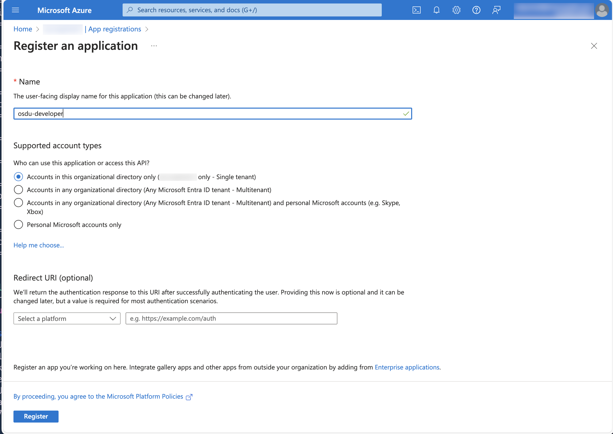
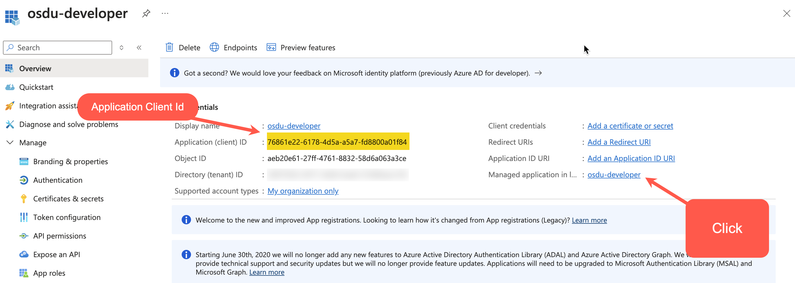
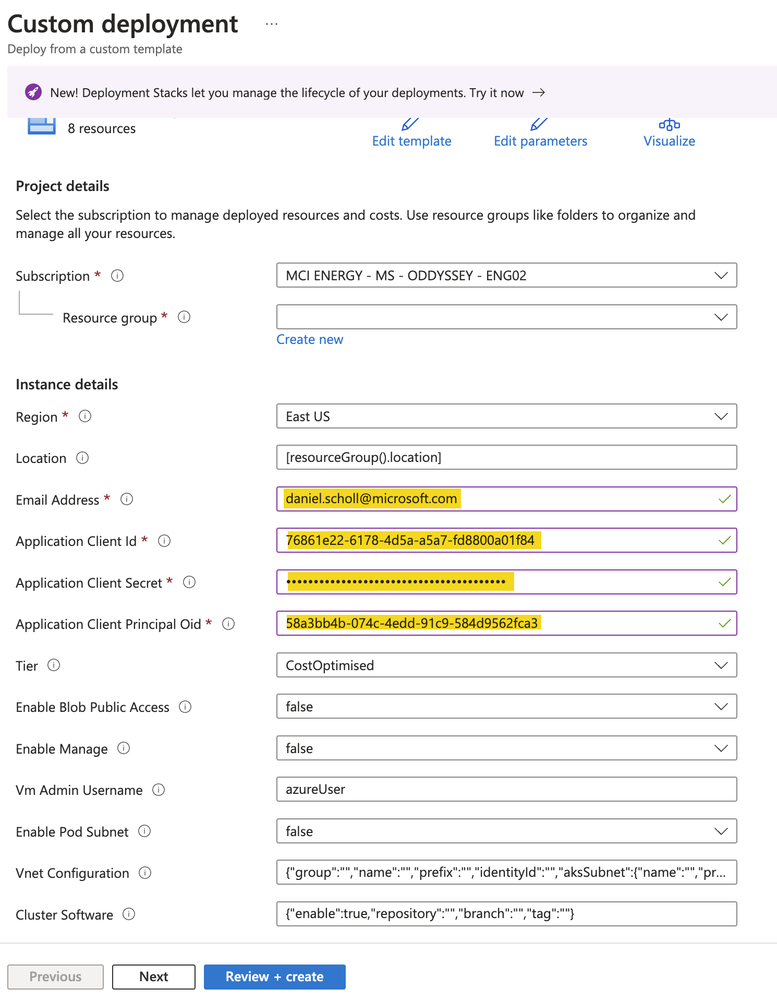

# How to deploy using native ARM Templates

The solution is a native bicep solution and includes a transpiled ARM template from the latest release.  This ARM template can then be easily used as a custom template deployment.

### 1. Retrieve an existing or create a new Microsoft Entra Application

The solution requires the use of an Application to be registered in Microsoft Entra.

### 2. Collect the required IDs and secret from the Application

Create a new client secret to use and note the following IDs for the application.

- Application Client Id
- Application Client Principal Oid

### 2. Open and fill out the template parameters

Click the `Deploy to Azure` button and fill out the required Parameters.

- Select the desired Subscription
- Select or create a new Resource Group
- Choose an Azure region to deploy into.

The following fields are mandatory fields to complete.

| **Field**    | **Description** |
|--------------|-----------------|
| Email Address | A valid email address for the first user in the Tenant. |
| Application Client Id | A valid GUID of the Entra Application Client Id|
| Application Secret | A valid Entra Application Secret |
| Application Client Principal Oid | A valid GUID for the Prinicpal Object Id |

Additional fields are all optional changes.  Please see feature flags for further details.

