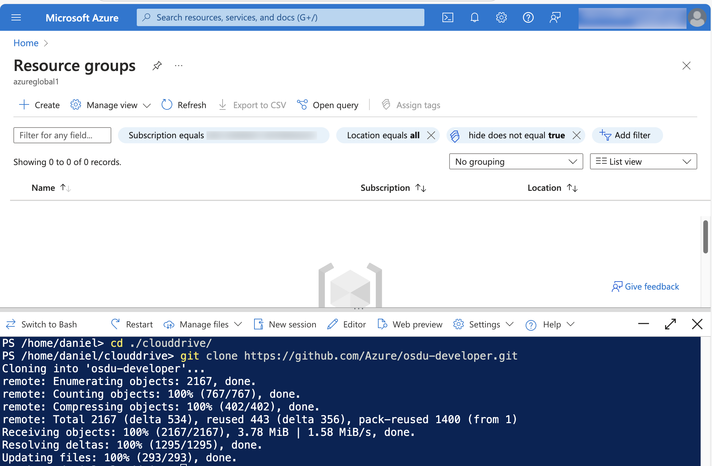

# How to deploy and test osdu using Azure Cloud Shell

This tutorial describe how to deploy OSDU and then test OSDU services using the Azure Cloud Shell

### Prepare your Cloud Shell Environment

This tutorial requires the use of Azure Cloud Shell with persistant files in the cloud-drive.

1. [How to Use Azure Cloud Shell](https://learn.microsoft.com/en-us/azure/cloud-shell/new-ui-shell-window)
2. [Persist Files in  Azure Cloud Shell](https://learn.microsoft.com/en-us/azure/cloud-shell/persisting-shell-storage)

Create a PowerShell profile for use with the helper functions.

```powershell
# Create a Profile
New-Item -Path $Profile -ItemType File -Force

# Edit the Profile
code Microsoft.PowerShell_profile.ps1

# Add the following helper functions to the profile.
function Show-Env
{
  Get-ChildItem Env:
}

function Invoke-Envrc {
    if (Test-Path .\.envrc) {
        $envVars = @{}

        function Resolve-EnvValue($value) {
            while ($value -match '\$\{(\w+)\}') {
                $varName = $matches[1]
                $varValue = if ($envVars.ContainsKey($varName)) { $envVars[$varName] } else { [System.Environment]::GetEnvironmentVariable($varName) }
                if ($varValue -eq $null) { break }
                $value = $value -replace [regex]::Escape('${' + $varName + '}'), $varValue
            }
            return $value
        }

        Get-Content .\.envrc | ForEach-Object {
            if ($_ -match '^\s*export\s+(\w+)=(".*?"|''.*?''|.*?)\s*$') {
                $name = $matches[1]
                $value = $matches[2].Trim('"', "'")
                
                # Store the raw value first
                $envVars[$name] = $value
            }
        }

        # Resolve all values after parsing
        $resolvedVars = @{}
        foreach ($kvp in $envVars.GetEnumerator()) {
            $resolvedValue = Resolve-EnvValue $kvp.Value
            $resolvedVars[$kvp.Key] = $resolvedValue
            [System.Environment]::SetEnvironmentVariable($kvp.Key, $resolvedValue, [System.EnvironmentVariableTarget]::Process)
        }
        
        Write-Host "Environment variables loaded from .envrc"
    } else {
        Write-Host ".envrc file not found in the current directory."
    }
}

New-Alias direnv Invoke-Envrc
New-Alias env Show-Env
```
Restart the Shell

[]

### Clone the solution to the CloudDrive

Using a new cloudshell session clone the solution to the persistent clouddrive.

```powershell
cd clouddrive
git clone https://github.com/Azure/osdu-developer.git
```

[]


### Deploy OSDU in the subscription

Using the Azure Developer CLI deploy the solution to your subscription after selected desired location and resource group name.

```powershell
cd clouddrive/osdu-developer
azd config set alpha.resourceGroupDeployments on
azd init -e <your_env_name>
azd provision
```


A successful deployment will result in an Identity Provider web page to open. Retrieve an Authorization Code and save it to the enviroment.

```powershell
azd env set AUTH_CODE=<your_auth_code>
azd hooks run settings
```

### Execute integration tests against the environment

Clone the OSDU Services to the persistent clouddrive

```powershell
# Install the git repo manager tool
pip install gita

# Clone the repositories
gita clone -f src/core/repos
```

Load the environment variables necessary for successful test execution of your environment.

```powershell
cd src
direnv  # Execute the powershell function to loadup the environment values
```

Change to service directories and execute integration tests.

> The following is the pattern of how to test services.

```powershell
# Test Partition Service
cd src/core/partition/testing/partition-test-azure
mvn test

# Test Entitlement Service
cd src/core/entitilements/testing/entitlements-v2-azure
mvn test
```
