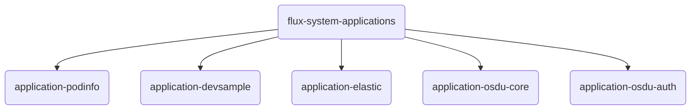

# Software Installation Sequence

```mermaid
flowchart TD
  FluxSystemApplications("flux-system-applications")
  Podinfo("application-podinfo")
  DevSample("application-devsample")
  ElasticSearch("application-elastic")
  OSDUCore("application-osdu-core")
  OSDUAuth("application-osdu-auth")

  FluxSystemApplications-->Podinfo
  FluxSystemApplications-->DevSample
  FluxSystemApplications-->ElasticSearch
  FluxSystemApplications-->OSDUCore
  FluxSystemApplications-->OSDUAuth
```