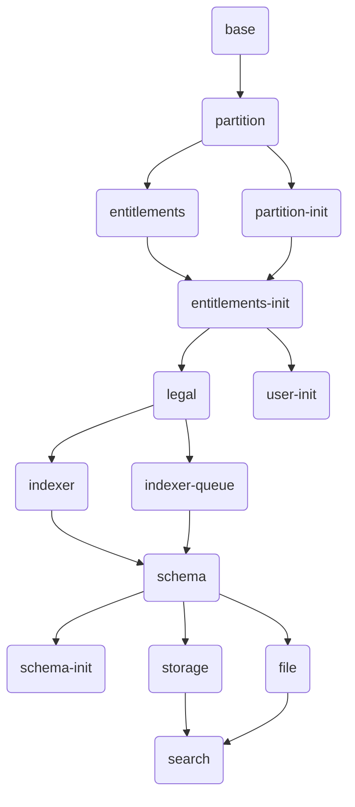

# Software Installation Sequence

```mermaid
flowchart TD
  base("base")
  partition("partition")
  partition_init("partition-init")
  entitlements("entitlements")
  entitlements_init("entitlements-init")
  legal("legal")
  indexer("indexer")
  indexer_queue("indexer-queue")
  user_init("user-init")
  schema("schema")
  schema_init("schema-init")
  storage("storage")
  file("file")
  search("search")

  base-->partition
  partition-->entitlements
  partition-->partition_init
  entitlements-->entitlements_init
  partition_init-->entitlements_init
  entitlements_init-->legal
  legal-->indexer
  legal-->indexer_queue
  entitlements_init-->user_init
  indexer-->schema
  indexer_queue-->schema
  schema-->schema_init
  schema-->storage
  schema-->file
  storage-->search
  file-->search
```