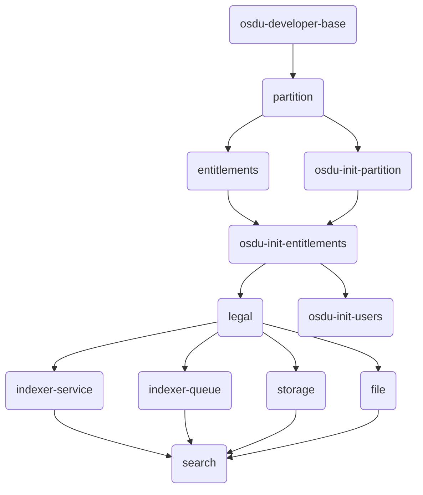

# Software Installation Sequence

```mermaid
flowchart TD
  osdu_developer_base("osdu-developer-base")
  partition("partition")
  osdu_init_partition("osdu-init-partition")
  entitlements("entitlements")
  osdu_init_entitlements("osdu-init-entitlements")
  legal("legal")
  indexer_service("indexer-service")
  indexer_queue("indexer-queue")
  storage("storage")
  file("file")
  search("search")
  osdu_init_users("osdu-init-users")

  osdu_developer_base-->partition
  partition-->entitlements
  partition-->osdu_init_partition
  entitlements-->osdu_init_entitlements
  osdu_init_partition-->osdu_init_entitlements
  osdu_init_entitlements-->legal
  legal-->indexer_service
  legal-->indexer_queue
  legal-->storage
  legal-->file
  indexer_service-->search
  indexer_queue-->search
  storage-->search
  file-->search
  osdu_init_entitlements-->osdu_init_users
```