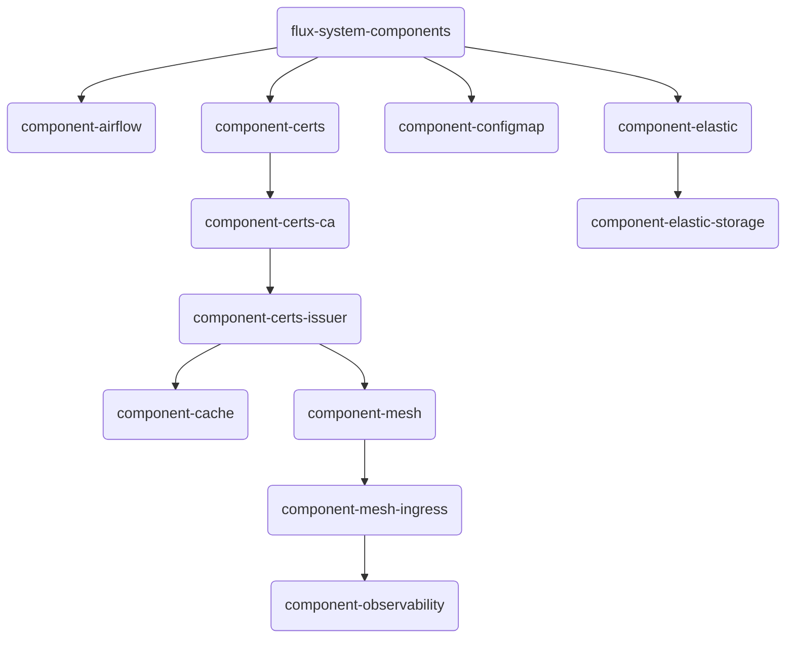

# Software Installation Sequence

```mermaid
flowchart TD
  FluxSystemComponents("flux-system-components")
  Airflow("component-airflow")
  Certs("component-certs")
  CertsCA("component-certs-ca")
  CertsCAIssuer("component-certs-issuer")
  Cache("component-cache")
  ConfigMap("component-configmap")
  Elastic("component-elastic")
  ElasticStorage("component-elastic-storage")
  Mesh("component-mesh")
  MeshIngress("component-mesh-ingress")
  Observability("component-observability")

  FluxSystemComponents-->Airflow
  FluxSystemComponents-->Certs
  Certs-->CertsCA
  CertsCA-->CertsCAIssuer
  CertsCAIssuer-->Cache
  CertsCAIssuer-->Mesh
  Mesh-->MeshIngress
  MeshIngress-->Observability
  FluxSystemComponents-->ConfigMap
  FluxSystemComponents-->Elastic
  Elastic-->ElasticStorage
```