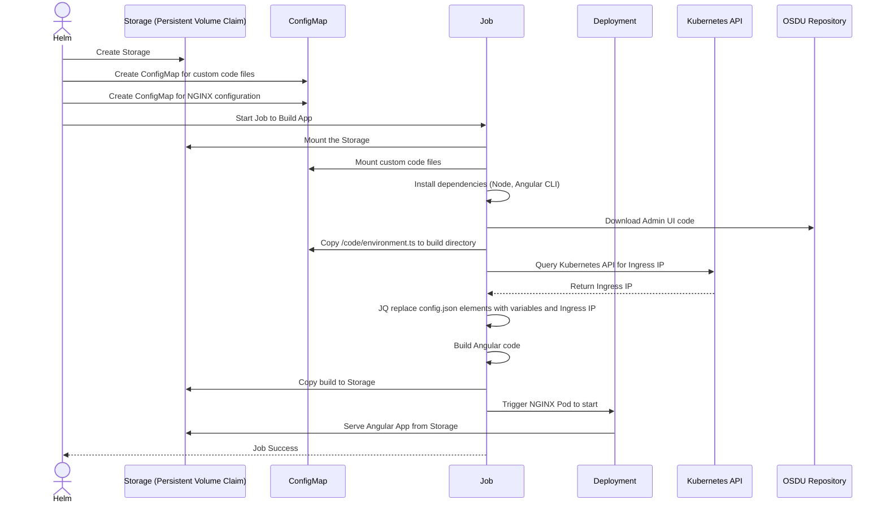

# Sequence Diagram of Admin UI process

```mermaid
sequenceDiagram
  actor Helm
  participant Storage as Storage (Persistent Volume Claim)
  participant ConfigMap
  participant Job
  participant Deployment
  participant K8s as Kubernetes API
  participant OSDU as OSDU Repository
  Helm->>Storage: Create Storage
  Helm->>ConfigMap: Create ConfigMap for custom code files
  Helm->>ConfigMap: Create ConfigMap for NGINX configuration
  Helm->>Job: Start Job to Build App
  Job->>Storage: Mount the Storage
  Job->>ConfigMap: Mount custom code files
  Job->>Job: Install dependencies (Node, Angular CLI)
  Job->>OSDU: Download Admin UI code
  Job->>ConfigMap: Copy /code/environment.ts to build directory
  Job->>K8s: Query Kubernetes API for Ingress IP
  K8s-->>Job: Return Ingress IP
  Job->>Job: JQ replace config.json elements with variables and Ingress IP
  Job->>Job: Build Angular code
  Job->>Storage: Copy build to Storage
  Job->>Deployment: Trigger NGINX Pod to start
  Deployment->>Storage: Serve Angular App from Storage
  Job-->>Helm: Job Success
```